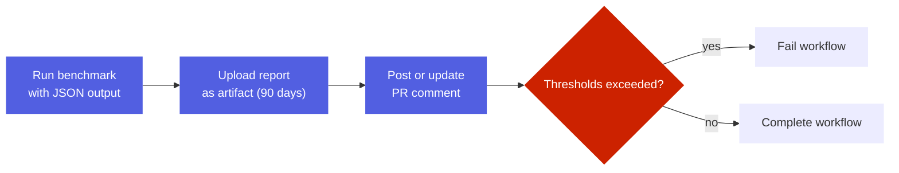

# Context Thresholds

<kbd>✅ Implemented</kbd> <kbd>🧪 Tested</kbd>

> **Current state:** Context threshold benchmarking is fully implemented with CI integration. Runs on every PR/push to main. See the [Status Glossary](../status-glossary.md) for chip definitions.

## Overview

The MCP context threshold system enforces limits on the token count of tool definitions, resources, and resource templates to prevent context bloat and ensure the MCP server remains efficient.

### Local Development

```bash
# Check current context usage (estimation only)
bun run estimate-context

# Run threshold benchmark (pass/fail check)
bun run benchmark-context

# Output benchmark report to file
bun run benchmark-context --output reports/context-benchmark.json

# Use custom threshold configuration
bun run benchmark-context --config custom-thresholds.json
```

### Threshold Configuration

The configuration file (`scripts/context-thresholds.json`) has the following structure:

```json
{
  "version": "1.0.0",
  "metadata": {
    "generatedAt": "2026-07-11",
    "description": "MCP context usage thresholds with manual headroom for resource/template growth",
    "baseline": {
      "tools": 14910,
      "resources": 440,
      "resourceTemplates": 1885,
      "total": 17235
    },
    "buffer": "custom"
  },
  "thresholds": {
    "tools": 15000,
    "resources": 1000,
    "resourceTemplates": 2000,
    "total": 20000
  }
}
```

### Current Baselines (as of 2026-07-11)

| Category | Baseline | Threshold (current) | Usage |
|----------|----------|------------------------|-------|
| Tools | 14,910 tokens | 15,000 tokens | 99% |
| Resources | 440 tokens | 1,000 tokens | 44% |
| Resource Templates | 1,885 tokens | 2,000 tokens | 94% |
| **Total** | **17,235 tokens** | **20,000 tokens** | **86%** |

## Benchmark Report Format

### Terminal Output

```text
================================================================================
MCP CONTEXT THRESHOLD BENCHMARK REPORT
================================================================================

Category                     Actual / Threshold       Usage  Status
--------------------------------------------------------------------------------
  Tools                        14910 / 15000    ( 99%)  ✓ PASS
  Resources                      440 / 1000     ( 44%)  ✓ PASS
  Resource Templates            1885 / 2000     ( 94%)  ✓ PASS
--------------------------------------------------------------------------------
  TOTAL                        17235 / 20000    ( 86%)  ✓ PASS
================================================================================

Overall Status: ✓ PASSED
```

### JSON Report

```json
{
  "timestamp": "2026-07-11T00:00:00.000Z",
  "passed": true,
  "results": {
    "tools": {
      "actual": 14910,
      "threshold": 15000,
      "passed": true,
      "usage": 99
    },
    "resources": {
      "actual": 440,
      "threshold": 1000,
      "passed": true,
      "usage": 44
    },
    "resourceTemplates": {
      "actual": 1885,
      "threshold": 2000,
      "passed": true,
      "usage": 94
    },
    "total": {
      "actual": 17235,
      "threshold": 20000,
      "passed": true,
      "usage": 86
    }
  },
  "thresholds": {
    "tools": 15000,
    "resources": 1000,
    "resourceTemplates": 2000,
    "total": 20000
  },
  "violations": []
}
```

## CI Integration

The GitHub Actions workflow runs automatically on:
- All pull requests
- Pushes to main branch

### Workflow Behavior



### PR Comment Format

| Category | Actual | Threshold | Usage | Status |
|----------|--------|-----------|-------|--------|
| Tools | 14,910 | 15,000 | 99% | ✅ |
| Resources | 440 | 1,000 | 44% | ✅ |
| Resource Templates | 1,885 | 2,000 | 94% | ✅ |
| **Total** | **17,235** | **20,000** | **86%** | ✅ |


## Updating Thresholds

When legitimate changes require increasing thresholds:


Estimation command:
```bash
bun run estimate-context
```

Update guidance:
- Set headroom based on expected growth
- Update metadata section with rationale

## Rationale

### Why Manual Headroom?

Manual headroom allows for:
- Larger shifts between tools, resources, and templates
- Planned growth without constant threshold churn
- Guardrails against unexpected regressions

### Category Tracking

Separate thresholds for tools, resources, and templates enable:
- Identifying which category is growing fastest
- Making informed decisions about optimization targets
- Understanding context distribution across MCP components

## Performance Impact

Token estimation is fast and suitable for CI:
- Full estimation: ~1-2 seconds
- Memory usage: minimal (< 100MB)
- No external dependencies beyond js-tiktoken

## Future Enhancements

Potential improvements to consider:

1. **Per-Item Thresholds**: Limit individual tool/resource token counts
2. **Historical Tracking**: Trend analysis over time via artifact reports
3. **Automatic Threshold Suggestions**: Calculate optimal thresholds from baseline
4. **Cost Estimation**: Convert token counts to API cost estimates
5. **Optimization Recommendations**: Identify tools that could be simplified
6. **Integration with Performance Budgets**: Link to broader performance goals

## Related Documentation

- [MCP Resources](resources.md) - Resource system design
- [MCP Server](index.md) - Overall MCP architecture
- [Validation Commands](https://github.com/kaeawc/auto-mobile/blob/main/CLAUDE.md) - Development validation workflows
