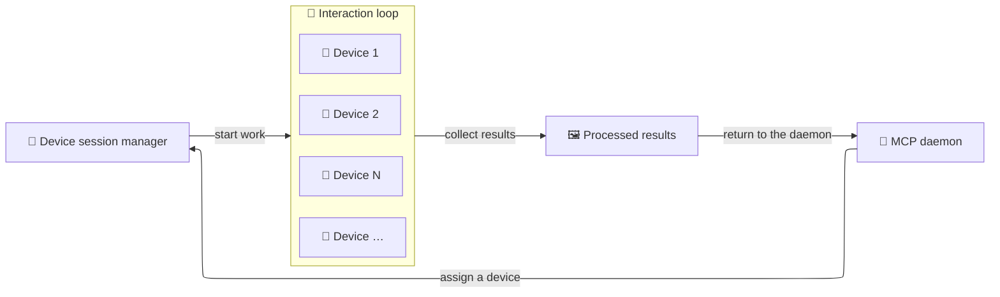

# Daemon

The AutoMobile daemon is a local background service that keeps a pool of
devices ready for work. It assigns a device to each session, proxies the same
MCP tools and resources, and returns the device to the pool when work ends.

This enables parallel test runs and coordinated multi-device actions without
each client needing to manage device processes itself. It can run as a
standalone service, within the MCP server, or temporarily in CI.
