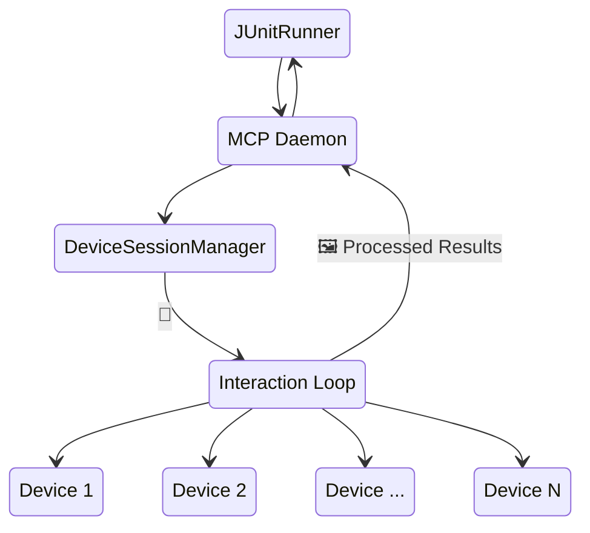

# Overview

<kbd>✅ Implemented</kbd> <kbd>🧪 Tested</kbd>

> **Current state:** Daemon mode is fully implemented. Device pool management, session allocation, Unix socket communication, and test timing tracking are all active. See the [Status Glossary](../../status-glossary.md) for chip definitions.

Background daemon service for device pooling and parallel test execution.
The AutoMobile daemon:

1. Maintains a pool of available devices specifically for running tests
2. Allocates devices to test sessions on demand
3. Tracks test execution history and performance to automatically optimize test distribution
4. Provides session management APIs

## Architecture

With Android in mind, JUnitRunner uses the MCP Daemon to orchestrate and control N devices under test. The daemon is a long-lived Node process with the same MCP capabilities, so it can replay the same interactions an AI agent would run. This architecture also enables multi-device features like [critical section](critical-section.md).



## Socket Communication

The daemon listens on a Unix socket at:
```typescript
/tmp/auto-mobile-daemon-<uid>.sock
```

## Socket API

The daemon exposes a full [Unix Socket API](unix-socket-api.md) for IDE plugins and the CLI. Endpoints cover:

- **IDE operations** — feature flags, service updates, SharedPreferences access
- **MCP proxy** — `tools/list`, `tools/call`, `resources/list`, `resources/read`
- **Daemon management** — device pool queries, session lifecycle

## MCP Device-Session Routing

An MCP connection can be bound to an already-allocated device-pool session at
startup. Integrations create their proxy with
`createProxyMcpServer({ proxyConfig: { initialSessionUuid } })` before the
first `tools/list`. That binding scopes discovery and every device-aware call
without relying on mutable active-device state, and remains specific to that
connection across daemon transport recreation.
The packaged stdio entrypoint accepts the same binding as
`--initial-session-uuid <uuid>`.

The device-pool session is separate from the MCP transport session and from a
tool-capability profile. When the bound device session is released, the
connection binding is removed; later sessionless calls do not recreate it.
`setActiveDevice` remains available as a migration compatibility API, but new
multi-client integrations should use connection-bound device-pool sessions.

If a confirmed device loss cancels an active call, the MCP result is an error
whose first text content item is machine-readable JSON of this form. It does
not include `structuredContent`, because the device-loss envelope is independent
of the interrupted tool's output schema:

```json
{
  "code": "device_lost",
  "deviceId": "emulator-5554",
  "sessionUuid": "device-session-1",
  "reason": "confirmed-unavailable"
}
```

## Session Heartbeats

The daemon reclaims sessions whose client heartbeat has gone stale. Sessions using the default heartbeat policy that never send their first heartbeat are reclaimed after a short grace period, while custom-heartbeat sessions, including autolock sessions, keep using their configured heartbeat timeout.

Deployment overrides are read from environment variables in milliseconds:

| Variable | Default | Purpose |
| --- | ---: | --- |
| `AUTOMOBILE_SESSION_HEARTBEAT_CHECK_INTERVAL_MS` | `10000` | How often the daemon scans for stale sessions. |
| `AUTOMOBILE_SESSION_PRE_FIRST_HEARTBEAT_GRACE_MS` | `5000` | Grace before reclaiming a default-heartbeat session that never sent its first heartbeat. |
| `AUTOMOBILE_SESSION_HEARTBEAT_INITIAL_GRACE_MS` | `20000` | Grace before evaluating stale custom-heartbeat sessions that never sent a heartbeat. |
| `AUTOMOBILE_SESSION_HEARTBEAT_TIMEOUT_MS` | `10000` | Default heartbeat timeout assigned to newly created sessions. |

Each variable also supports the legacy `AUTO_MOBILE_...` prefix.

## Running Many Agents on One Host

When several agents run in parallel against one shared daemon, the filesystem and
environment follow a contract: each agent executes tools in its own process
(proxy mode is test-only), so the device caches are multi-writer. See the
[Multi-Agent Filesystem Contract](multi-agent-filesystem-contract.md) for the
ownership model, the required env vars, and the recommended per-agent `TMPDIR`
isolation.

## Implementation

The daemon is implemented in the main AutoMobile MCP server and can run:

- **Standalone** - As a background service
- **Embedded** - Within the MCP server process
- **CI Mode** - Temporary pools for CI environments

See [MCP Server](index.md) for integration details.
