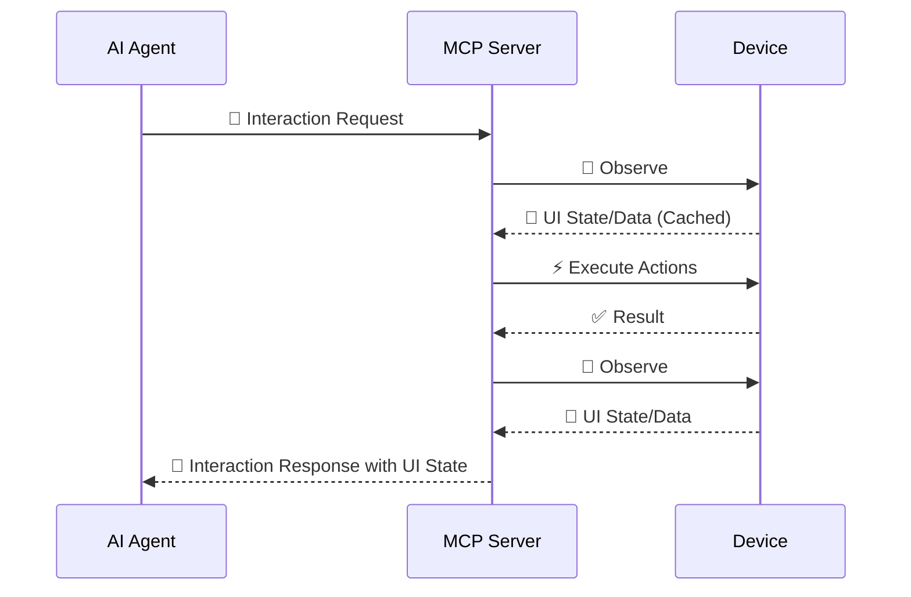

# Interaction Loop

AutoMobile uses an observe → execute → observe loop. The complete loop is
implemented with UI-stability checks before and after action execution.

Observation captures the current UI state and hierarchy. The client then sends
an action, and AutoMobile returns the result together with a fresh observation.
This gives the client enough context to choose the next action without relying
on stale screen state.

Most action tools include the updated observation automatically. Use standalone
`observe` to inspect the current screen without changing it. When a screen is
loading, wait for the target state before acting and prefer stable text,
resource IDs, content descriptions, or app-defined test tags over coordinates.

## Settled embedded observations

A navigation-class action (`tapOn`, `tapAny`, `openLink`, `homeScreen`,
`recentApps`, a navigation `pressButton`, and a submitting `inputText` /
`sendKeys` / `imeAction`) replaces the screen. Android can hand back a
hierarchy for the destination before that screen finishes inflating, so the
capture embedded in the action's response could miss a child that had not
attached yet — for Settings rows, the `switchWidget` node that is the only
carrier of `toggle` / `checked` — and the parent row's content-derived `s2-…`
elementId would then change on the client's next `observe`.

For those actions AutoMobile now gates the embedded capture on hierarchy
stability before returning it, using the same settle primitive standalone
`observe(waitFor: {for: "stable"})` uses: re-observe until two consecutive
hierarchies are structurally equal, bounded at 1000 ms and cancelled with the
request. In-place and scroll actions are unchanged and keep their single
capture.

Every action observation carries a `settled` boolean saying whether that
capture passed the gate:

- `settled: true` — two consecutive stable hierarchies; the screen is the
  settled post-action screen and its `s2-…` ids match what the next `observe`
  will emit.
- `settled: false` — the capture was not stability-checked. Either the action
  was not navigation-class, or the bound expired on a screen that never
  reaches structural stability (a ticking clock, a blinking caret). Re-observe
  if the completeness of the screen matters.

In diff mode (`--actions-diff-observe`) the flag rides on the diff alongside
`activeWindow` and `freshness`, so one accessor works in both modes.
