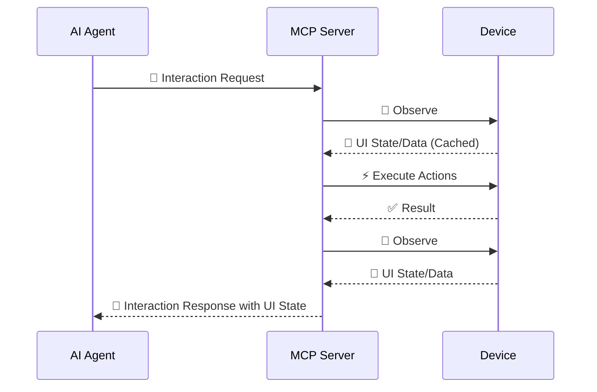

# Interaction Loop

AutoMobile uses an observe → execute → observe loop. The complete loop is
implemented with UI-stability checks before and after action execution.

Observation captures the current UI state and hierarchy. The client then sends
an action, and AutoMobile returns the result together with a fresh observation.
This gives the client enough context to choose the next action without relying
on stale screen state.

Most action tools include the updated observation automatically. Use standalone
`observe` to inspect the current screen without changing it. When a screen is
loading, wait for the target state before acting and prefer stable text,
resource IDs, content descriptions, or app-defined test tags over coordinates.
