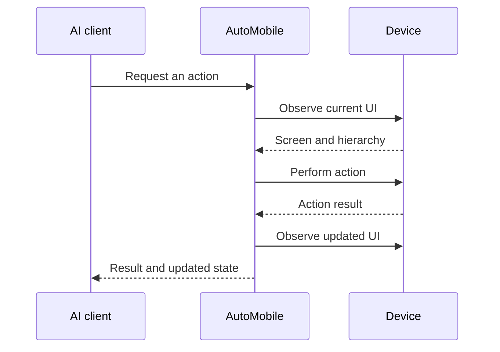

# Observation loop

AutoMobile uses an observe → act → observe loop:

Most action tools include the updated observation automatically. Use standalone
`observe` when you need to inspect the current screen without changing it.

When a screen is loading or moving, wait for the target state before acting.
Prefer stable text, resource IDs, content descriptions, or app-defined test tags
over coordinates. If an action fails, observe again before retrying.

