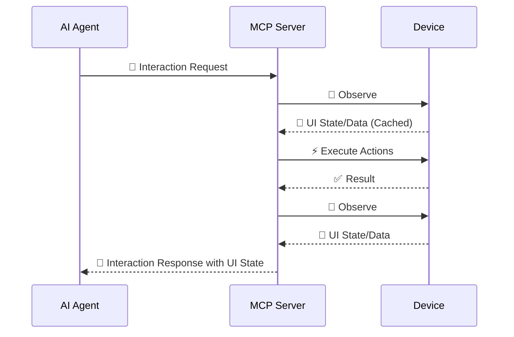

# Interaction Loop

AutoMobile uses an observe → execute → observe loop. The complete loop is
implemented with UI-stability checks before and after action execution.

Observation captures the current UI state and hierarchy. The client then sends
an action, and AutoMobile returns the result together with a fresh observation.
This gives the client enough context to choose the next action without relying
on stale screen state.

```mermaid
sequenceDiagram
  participant Agent as AI Agent
  participant MCP as MCP Server
  participant Device

  Agent->>MCP: 🤖 Interaction Request
  MCP->>Device: 👀 Observe
  Device-->>MCP: 📱 UI State/Data (Cached)

  MCP->>Device: ⚡ Execute Actions
  Device-->>MCP: ✅ Result

  MCP->>Device: 👀 Observe
  Device-->>MCP: 📱 UI State/Data
  MCP-->>Agent: 🔄 Interaction Response with UI State
```

Most action tools include the updated observation automatically. Use standalone
`observe` to inspect the current screen without changing it. When a screen is
loading, wait for the target state before acting and prefer stable text,
resource IDs, content descriptions, or app-defined test tags over coordinates.

The default observe skeleton marks a disabled Android or iOS control with
`enabled: false`. Enabled rows omit the field. Toggle rows also carry their
`checked` boolean; selected and focused state remain in full/raw output.
Full/raw hierarchy and element output preserve the explicit disabled `enabled`
value. The marker describes state and does not change `tapOn` selection or
execution. An enabled-state transition appears in hierarchy diffs and prevents
the settle comparator from treating the two captures as equal.

## Settled embedded observations

A navigation-class action (`tapOn`, `tapAny`, `openLink`, `homeScreen`,
`recentApps`, a navigation `pressButton`, and a submitting `sendKeys`) replaces
the screen. Android can hand back a
hierarchy for the destination before that screen finishes inflating, so the
capture embedded in the action's response could miss a child that had not
attached yet — for Settings rows, the `switchWidget` node that is the only
carrier of `toggle` / `checked` — and the parent row's content-derived `s2-…`
elementId would then change on the client's next `observe`.

For those actions AutoMobile now gates the embedded capture on hierarchy
stability before returning it, using the same settle primitive standalone
`observe(waitFor: {for: "stable"})` uses: re-observe until two consecutive
hierarchies are structurally equal, bounded at 1000 ms and cancelled with the
request. In-place and scroll actions are unchanged and keep their single
capture.

Every action observation carries a `settled` boolean saying whether that
capture passed the gate:

- `settled: true` — two consecutive stable hierarchies; the screen is the
  settled post-action screen and its `s2-…` ids match what the next `observe`
  will emit.
- `settled: false` — the capture was not stability-checked. Either the action
  was not navigation-class, or the bound expired on a screen that never
  reaches structural stability (a ticking clock, a blinking caret). Re-observe
  if the completeness of the screen matters.

In diff mode (`--actions-diff-observe`) the flag rides on the diff alongside
`activeWindow` and `freshness`, so one accessor works in both modes.

## Default compact action metadata

Compact action metadata defaults on. Opt out with
`AUTOMOBILE_ACTIONS_COMPACT_METADATA=0`, `--no-actions-compact-metadata`, or
feature-flag key `actions-compact-metadata` set to false. The existing
`--actions-compact-metadata` or exact env `1` explicitly enables it. Negative CLI
wins over positive CLI, then exact env `0`/`1`, then persisted state, then on.
Without an explicit choice (unset or other env values), proxies relay no preference
and preserve the shared daemon's effective setting without a reconciliation restart.
With an external action call's `sessionUuid` and session store,
this omits each unchanged `observation` block independently: `insets`,
`systemInsets`, `backStack`, `gfxMetrics`, `displayedTimeMetrics`, `deviceLock`,
`accessibilityState`, and `freshness`. Raw observations' `viewHierarchy.insets`
and `viewHierarchy.systemInsets` copies follow the same rule independently.
Values must be deeply equal except `backStack.capturedAt`. Stale freshness,
unstable gfx metrics, and partial back stacks remain inline even if unchanged.
The first action response sends available blocks in full, changes resend the
changed block, and a new session or any device switch sends available blocks
in full again. `screenSize`, `display`, and observation/device join keys remain
present. A top-level `element` is omitted only when deeply equal to
`selectedElement.matchedElement` and its output schema allows omission.

Compaction follows projection and diff emission. With `--actions-diff-observe`,
only metadata actually emitted by the diff can be compacted (including its
`freshness` passthrough); the hierarchy diff baseline is unchanged. With
`--actions-no-observe`, there are no observation blocks to compact or remember,
but duplicate element removal still applies. An empty snapshot on a device
switch invalidates the previous device's metadata without claiming delivery.

Only blocks that survive artifact and oversized-residue spills **inline** are
remembered as sent, and artifacts are always written from the uncompacted payload;
an artifact pointer does not count as delivery. Any non-internal session-scoped
response that carries a block inline (including `observe` and error responses,
which never omit blocks themselves) updates the record for exactly those blocks.
`freshness` with `isFresh !== true` and `gfxMetrics` with `isStable === false`
are always sent. Internal tool-to-tool calls neither omit nor record, and calls
without a session/store emit the existing full response. The record lives in the
session cache and is cleared on session release/rebind. It is written while the
response is finalized, before the transport sends it, so a response dropped
after that point leaves the client without the omitted block until it changes.
