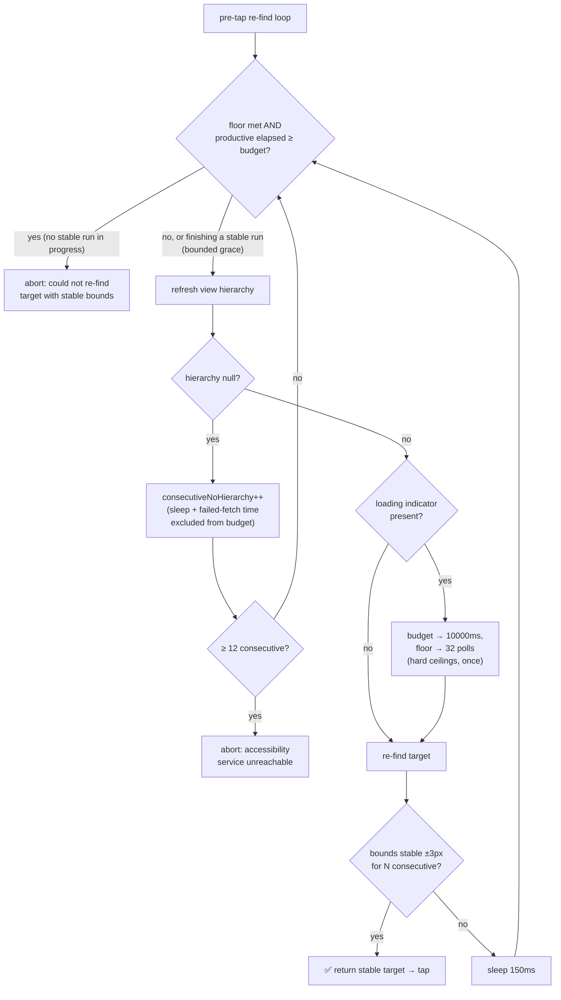

# Loading-State Awareness

<kbd>✅ Implemented</kbd> <kbd>🧪 Tested</kbd> <kbd>🤖 Android Only</kbd>

> **Current state:** The pre-tap re-find loop on Android now bounds its patience by a
> **wall-clock deadline** instead of a fixed attempt count, and **extends that deadline**
> when the accessibility tree shows a blocking loading indicator (progress bar / shimmer).
> This is the v1 that closes [issue #1949](https://github.com/kaeawc/auto-mobile/issues/1949).
> A larger multi-signal loading model was designed and deliberately deferred — see
> [§4 Aspirational future direction](#4-aspirational-future-direction). See the
> [Status Glossary](../status-glossary.md) for chip definitions.

---

## 1. Problem

From [issue #1949](https://github.com/kaeawc/auto-mobile/issues/1949):

> When a search-result list shows a loading spinner between `observe` and `tapOn`, a
> fixed retry budget for re-finding the element can expire before the list content
> reappears.

The literal defect was that the pre-tap stability loop in
[`TapOnElement.ts`](../../../src/features/action/TapOnElement.ts) expressed its patience
as **`N attempts × poll delay`**. That couples the real wall-clock window to the polling
cadence and per-refresh fetch latency, so the budget could run out before a loading list
repopulated — even though the target eventually reappeared.

A prior narrow fix already existed: [`androidTransientLoading.ts`](../../../src/utils/androidTransientLoading.ts)
regex-matches `ProgressBar` / `ShimmerFrameLayout` / `ContentLoadingProgressBar` and bumped
the attempt ceiling from 8 → 32. v1 keeps that detector but changes what the extension buys:
**wall-clock time, not attempts.**

## 2. What we implemented (v1)

Scope: the Android pre-tap re-find loop, `resolveAndroidStableTapTargetAfterRefreshes`.
The change is deliberately small and preserves every existing safety property.

### 2.1 Patience is bounded by BOTH a poll floor and a wall-clock deadline

The loop keeps polling until **both** a minimum productive-poll count **and** a wall-clock
deadline are exceeded (`refindAttempt >= minPolls && productiveElapsed >= budgetMs`). Two
bounds, because neither alone is correct — this was the key finding from adversarial review:

- The **wall-clock deadline** adds patience when fetches are fast. A fixed
  "N attempts × poll delay" budget expires in ~1.2 s and can miss a list that repopulates a
  few seconds later (#1949).
- The **productive-poll floor** prevents a regression in the opposite regime. On a slow
  device where each hierarchy fetch costs 300–800 ms, real fetch latency counts against a
  pure wall-clock budget, so 2500 ms would buy only ~3–5 polls — _fewer_ than the old fixed 8. The floor guarantees we never poll fewer times than the previous implementation, so the
  change is **never less patient** than before, in any fetch-speed regime.

These are compile-time `private static readonly` fields on `TapOnElement` — they
are **not** environment-tunable at runtime (there is no `process.env` override
path; the `ANDROID_PRE_TAP_*` names are constant identifiers, not env vars).

|                                    | base    | when loading detected |
| ---------------------------------- | ------- | --------------------- |
| `ANDROID_PRE_TAP_REFIND_BUDGET_MS` | 2500 ms | 10000 ms              |
| `ANDROID_PRE_TAP_REFIND_MIN_POLLS` | 8       | 32                    |

Success still returns immediately when the target's bounds are stable within ±3 px for the
required consecutive re-finds — the common case is unchanged and fast.

### 2.2 "No hierarchy" recovery time is fully excluded from the budget

A temporarily-unresponsive ctrl-proxy WebSocket (refresh returns `null`) must **not** consume
the element's patience — that streak is bounded separately by
`ANDROID_PRE_TAP_NO_HIERARCHY_MAX_CONSECUTIVE = 12` with its own 500 ms backoff. v1 excludes
from the deadline **both** the recovery sleep **and** the wall-clock the failed refresh itself
burned (up to the 800 ms timeout) — the latter matters because on a real device a null result
usually _is_ a timeout, and counting only the sleep would let a slow proxy silently eat the
budget:

```ts
const productiveElapsedMs = this.timer.now() - startTime - noHierarchyTimeMs;
const budgetExhausted = refindAttempt >= minProductivePolls && productiveElapsedMs >= budgetMs;
// ...on a null refresh:
noHierarchyTimeMs += this.timer.now() - refreshStart; // exclude the failed fetch's wall-clock too
```

The floor also backstops this: because null polls never increment `refindAttempt`, they can
never reduce the guaranteed productive-poll count regardless of timing.

### 2.3 Loading detection extends both bounds (not the attempt count)

The existing `androidViewHierarchyIndicatesLikelyBlockingLoading()` still runs each productive
iteration; when it fires, it raises the deadline and the floor once (monotonic — later
non-loading hierarchies never shrink them back):

```ts
if (
  androidViewHierarchyIndicatesLikelyBlockingLoading(freshHierarchy, this.elementParser) &&
  budgetMs < ANDROID_PRE_TAP_REFIND_BUDGET_MS_WHEN_LOADING
) {
  budgetMs = ANDROID_PRE_TAP_REFIND_BUDGET_MS_WHEN_LOADING;
  minProductivePolls = ANDROID_PRE_TAP_REFIND_MIN_POLLS_WHEN_LOADING;
}
```

### 2.4 Deadline grace for in-progress stability runs

The deadline break is skipped during a null-recovery streak. A subtlety surfaced in review:
if a null streak resets stability progress right as the deadline passes, a sibling selector
(which needs 2 consecutive stable matches) could be failed even though the target is present
and stable. v1 grants a small grace — up to `stableMatchesRequired` extra polls past the
deadline to finish confirming an already-stable candidate — bounded so a perpetually-shifting
target cannot extend forever. A defensive `ANDROID_PRE_TAP_MAX_ITERATIONS` backstop guards
against a future refactor that stops advancing the injected timer.

### 2.5 Behavior



### 2.6 What did NOT change

- The consecutive-stable-bounds requirement (±3px, `androidPreTapConsecutiveStableMatchesRequired`)
  — the anti-mis-tap guarantee is untouched.
- The separate no-hierarchy budget, its 500 ms backoff, and its distinct error message.
- The 150 ms normal poll delay, the 800 ms per-refresh timeout, abort-signal handling.
- iOS: the iOS tap strategy does not run pre-tap stability, so this change is Android-only.

### 2.7 Tests

[`TapOnElement.preTapStability.test.ts`](../../../test/features/action/TapOnElement.preTapStability.test.ts)
(FakeTimer, no device):

- Existing behavior re-verified: immediate stability, epsilon convergence, target never
  re-found, null-recovery, the 12-consecutive-null abort, null-counter reset, longer delay
  after null, 2-consecutive-stable for churn-prone selectors, abort signal.
- `fails when bounds never stabilize` reworked to shift bounds for the whole wall-clock
  budget (it previously relied on the attempt cap).
- **Pinning #1949 (with symbolic budget/elapsed assertions, so the specific values are what's
  tested):** `extends budget when loading indicators present…` and its decisive negation
  `without loading indicators, gives up right at the base budget` (asserts elapsed ≈ 2500 ms).
- **Regression guards from review:** `guarantees the productive-poll floor even when every
fetch is slow` (simulates 800 ms fetches — a pure deadline would bail at ~3 polls; the floor
  keeps ≥ 8); `detects a loading indicator that appears mid-stream and extends late`;
  `loading budget is bounded — a target that never appears still fails at the ceiling`
  (~10000 ms, not forever); `extended budget is not reset by a later non-loading hierarchy`.

## 3. Deliberately out of scope for v1

The three-reviewer critique flagged these as either unsupported by the current data model or
YAGNI. They are **not** built:

- **Positive `enabled=true` readiness gating.** The ctrl-proxy emitter drops the `enabled`
  attribute when false, so absent-`enabled` cannot today be distinguished from "unknown";
  gating on it would stall healthy taps. A prerequisite emitter change is required first.
- **Determinate-progress escape (`RANGE_INFO`).** Not extracted into the node model today.
- **Pixel-stability / network-activity signals.** New I/O subsystems; deferred.
- **Confidence-score fusion, geometry/z-order gate, `SettlePolicy`, `observe` surfacing.**
  Deferred until a second consumer and real evidence justify the machinery.

## 4. Aspirational future direction

If loaders that the regex cannot name (Compose skeletons, WebView/canvas spinners) show up in
practice, the intended evolution — in rough priority — is:

1. **Promote positive target readiness to the primary mechanism.** Poll a predicate on the
   target (`exists ∧ interactable ∧ bounds-stable ∧ not-occluded`) to a deadline, treating
   absent-`enabled` as "assume ready." This subsumes most tree-based loading detection.
   Prerequisite: fix the ctrl-proxy `enabled` emitter to distinguish explicit-false.
2. **Add at most one structural signal** (empty list container / skeleton cluster) behind the
   existing helper, still returning a boolean + budget-ms — no fusion framework.
3. **One region pixel-diff signal** for genuinely tree-blind surfaces (WebView/canvas/video),
   where there is no target node to run a predicate against.
4. **Instrumentation tier first for first-party targets.** For AutoMobile's own android/ios
   test apps, an app-exported `busy`/`idle` marker is ground truth (Espresso IdlingResource
   model) and beats every heuristic.
5. **Cross-platform readiness**, not Android-shaped signals with iOS stapled on. The iOS
   quiescence probe must stay timeout-bounded to avoid the known SpringBoard-vs-app 65 s hang.

Rejected outright: globally raising the fixed budget, an ML screenshot classifier, fixed
`sleep()` after navigation, and confidence-score fusion whose scalar is never actually
branched on.

## See Also

- [Interaction Loop](interaction-loop.md)
- [Observe](observe/index.md)
- [Status Glossary](../status-glossary.md)
- Issue [#1949](https://github.com/kaeawc/auto-mobile/issues/1949)
