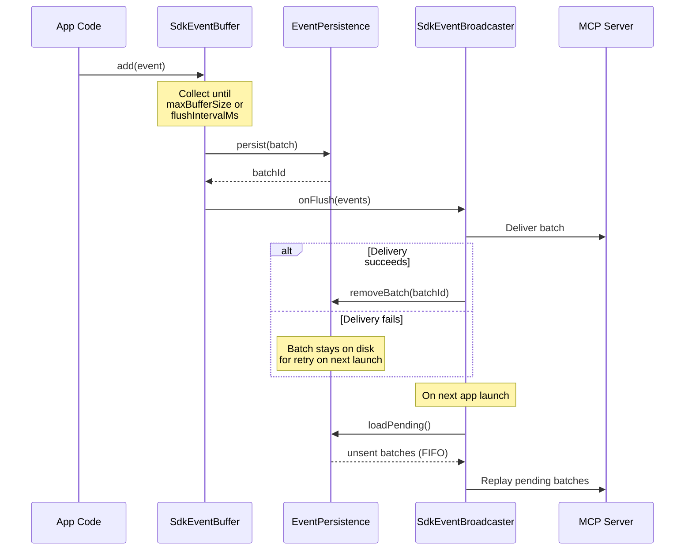
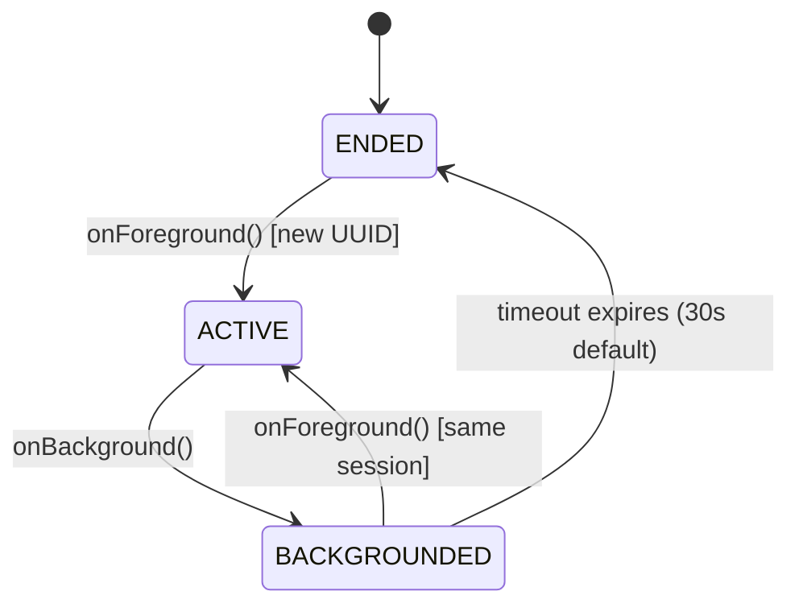

# SDK Event Pipeline & Crash Handling

<kbd>✅ Implemented</kbd> <kbd>🧪 Tested</kbd>

> **Current state:** Both Android and iOS SDKs implement a shared event pipeline architecture with disk-first persistence, buffered broadcasting, crash/hang detection, breadcrumb trails, and session tracking. See the [Status Glossary](../status-glossary.md) for chip definitions.

## Overview

The AutoMobile SDK event pipeline collects telemetry from instrumented apps and delivers it to the MCP server for real-time observability. Both platforms follow the same conceptual architecture: events flow through a thread-safe buffer, are persisted to disk before broadcast, and are delivered in batches to minimize overhead.

## Event Flow

## Core Components

| Component                           | Description                                             | Status                    |
| ----------------------------------- | ------------------------------------------------------- | ------------------------- |
| `SdkEventBuffer`                    | Thread-safe buffer that flushes on capacity or timer    | <kbd>✅ Implemented</kbd> |
| `SdkEventBroadcaster`               | Serializes and delivers event batches cross-process     | <kbd>✅ Implemented</kbd> |
| `EventPersistence`                  | Disk-first persistence for crash resilience             | <kbd>✅ Implemented</kbd> |
| `DropCounter`                       | Back-pressure metrics tracking dropped events by reason | <kbd>✅ Implemented</kbd> |
| `AutoMobileCrashes`                 | Unhandled crash detection with thread dumps             | <kbd>✅ Implemented</kbd> |
| `AutoMobileFailures`                | Handled (non-fatal) exception recording                 | <kbd>✅ Implemented</kbd> |
| `BreadcrumbTrail`                   | Ring buffer of recent actions attached to crash reports | <kbd>✅ Implemented</kbd> |
| `SessionTracker`                    | Foreground/background lifecycle session rotation        | <kbd>✅ Implemented</kbd> |
| `SdkContext`                        | Thread-safe ambient state (session, user, tags)         | <kbd>✅ Implemented</kbd> |
| `AutoMobileAnr` / `AutoMobileHangs` | ANR/hang detection (platform-specific)                  | <kbd>✅ Implemented</kbd> |

## Disk-First Persistence

Events are written to disk **before** broadcast to survive process death. Each batch is stored as a single JSON file named `events_{timestamp}_{uuid}.json`, providing FIFO ordering by filename sort.

On successful delivery, the batch file is deleted. On failure (broadcast error, app crash during delivery), the file remains on disk and is replayed on the next app launch via `loadPending()`.

Stale batches are cleaned up by `cleanup(maxAgeDays:)` (default 7 days) to prevent unbounded disk growth.

## Buffer Tuning

`SdkEventBuffer` controls the trade-off between latency and overhead:

| Parameter         | Default | Description                             |
| ----------------- | ------- | --------------------------------------- |
| `maxBufferSize`   | 50      | Events collected before a forced flush  |
| `flushIntervalMs` | 500     | Periodic flush interval in milliseconds |

When either threshold is reached, the buffer drains into the broadcaster. The buffer is protected by a lock (`ReentrantLock` on Android, `NSLock` on iOS) and supports `isEnabled` toggling at runtime.

### DropCounter

`DropCounter` tracks events that could not be delivered, categorized by reason:

| Reason            | Trigger                                                   |
| ----------------- | --------------------------------------------------------- |
| `DISABLED`        | Event added while buffer is disabled                      |
| `SHUTDOWN`        | Event dropped because the buffer was shut down (see note) |
| `FLUSH_ERROR`     | Delivery callback threw an exception                      |
| `BUFFER_OVERFLOW` | Buffer at capacity when the event arrived                 |
| `FILTERED`        | Event removed by a filter/processor before delivery       |
| `DELIVERY_FAILED` | Delivery attempted but did not succeed                    |
| `PROCESSOR_ERROR` | An event processor threw (Android only)                   |

Android defines all seven reasons (`DropReason.kt`); iOS defines six — it has no
`processorError` case (`DropCounter.swift`).

**Note on `SHUTDOWN`:** the enum value exists on both platforms, but only Android
_drops with_ `SHUTDOWN` — its `SdkEventBuffer.add()` rejects post-shutdown events
and records the drop. iOS `shutdown()` flushes instead of dropping, so the iOS
`shutdown` case is defined but not emitted on that path.

The counter provides `snapshot()` for diagnostics and `reset()` to clear counts. Android uses `ConcurrentHashMap<DropReason, AtomicLong>` for lock-free increments; iOS uses `NSLock` with a `[DropReason: Int]` dictionary.

## Crash Detection

Both platforms install an unhandled exception handler that fires before the process terminates.

### Crash flow

1. Exception handler captures the error (class, message, stack trace)
2. All-thread dumps are collected for full crash context (Android only -- iOS lacks a public API for cross-thread stacks)
3. Breadcrumb trail snapshot is serialized and attached
4. Device info and current screen name are collected
5. Crash event is broadcast/buffered for delivery
6. Original handler is chained to preserve default crash behavior

### Android: `AutoMobileCrashes`

- Installs `Thread.UncaughtExceptionHandler`
- Calls `Thread.getAllStackTraces()` for all-thread dumps, capped at 50KB to stay under Android's 1MB Binder limit
- Broadcasts crash via scoped `Intent` to the accessibility service package
- Sleeps 200ms after broadcast to allow dispatch before process termination
- Serializes breadcrumbs with binary-search truncation to fit within 50KB

### iOS: `AutoMobileCrashes`

- Installs `NSSetUncaughtExceptionHandler` for ObjC/Swift exceptions
- Optional signal handlers (`enableSignalHandlers()`) for SIGABRT, SIGSEGV, SIGBUS, SIGFPE, SIGILL (SIGTRAP excluded to avoid debugger interference)
- Signal handler writes signal number to a file using only async-signal-safe POSIX calls (`open`, `write`, `close`)
- On next launch, `checkPreviousSignalCrash()` reads the file and emits a crash event
- Chains to previous exception/signal handlers to preserve other crash reporters

## ANR / Hang Detection

### Android: `AutoMobileAnr`

Uses the `ApplicationExitInfo` API (Android 11+ / API 30) to detect ANRs from **previous sessions**. On initialization:

1. Queries `ActivityManager.getHistoricalProcessExitReasons()` for `REASON_ANR` entries
2. Filters out already-reported ANRs using a persisted timestamp in `SharedPreferences`
3. Reads ANR trace from `exitInfo.traceInputStream`
4. Broadcasts new ANR events to the accessibility service

This is a **retrospective** approach -- ANRs are reported on the next app launch, not in real time.

### iOS: `AutoMobileHangs`

Uses a **watchdog thread** to detect main thread hangs in real time:

1. A background thread dispatches a block to the main queue via `DispatchQueue.main.async`
2. Waits on a `DispatchSemaphore` with a configurable timeout (`hangThresholdMs`, default 2000ms)
3. If the semaphore times out, the main thread is considered hung
4. Reports a `SdkHangEvent` with the measured duration
5. Polls at `pollIntervalMs` intervals (default 500ms)

Note: iOS does not provide a public API to capture another thread's call stack. The watchdog captures its own stack as a diagnostic marker. For production hang diagnostics, Apple recommends MetricKit's `MXHangDiagnostic` (iOS 16+).

## Session Tracking

`SessionTracker` manages user sessions based on app foreground/background lifecycle:

A new session ID (UUID) is generated on the first `onForeground()` call or after the background timeout expires. The timeout is configurable (default 30 seconds) and cancellable -- returning to foreground before expiry resumes the same session.

Both platforms use injectable timer factories and UUID providers for deterministic testing.

## Breadcrumb Trail

`BreadcrumbTrail` is a thread-safe ring buffer that records recent user actions. When full, the oldest breadcrumb is evicted.

| Property  | Default |
| --------- | ------- |
| `maxSize` | 100     |

Each `Breadcrumb` contains:

- `timestamp` -- when the action occurred
- `category` -- one of `NAVIGATION`, `TAP`, `LIFECYCLE`, `NETWORK`, `LOG`, `CUSTOM`
- `message` -- human-readable description
- `metadata` -- optional key-value pairs

Breadcrumbs are attached to crash reports to provide context about what the user was doing before the crash. On Android, the serialized JSON is truncated via binary search to fit within 50KB. On iOS, `BreadcrumbTrail` additionally supports `writeToDisk()` / `loadFromDisk()` for crash resilience across sessions.

## SDK Context

`SdkContext` holds ambient state that can be attached to events:

- `sessionId` -- current session identifier (set by `SessionTracker`)
- `userId` -- optional user identifier
- `appVersion` -- app version string
- `tags` -- arbitrary key-value metadata

Thread-safe access is provided via locks. `snapshot()` returns an immutable copy of the current state.

## Platform Comparison

| Aspect                          | Android                                                    | iOS                                                                |
| ------------------------------- | ---------------------------------------------------------- | ------------------------------------------------------------------ |
| **Language**                    | Kotlin                                                     | Swift                                                              |
| **Thread safety**               | `ReentrantLock`, `@Volatile`, `ConcurrentHashMap`          | `NSLock`, `@unchecked Sendable`                                    |
| **Event delivery**              | Scoped `Intent` broadcast to accessibility service package | `NotificationCenter` (in-process) + HTTP POST to CtrlProxy (debug) |
| **Batch size limit**            | 100KB per Intent (recursive split)                         | No hard limit (HTTP POST)                                          |
| **Crash handler**               | `Thread.UncaughtExceptionHandler`                          | `NSSetUncaughtExceptionHandler` + optional signal handlers         |
| **All-thread dumps**            | `Thread.getAllStackTraces()` (50KB cap)                    | Not available (no public API)                                      |
| **Signal crash persistence**    | N/A                                                        | Writes signal number to file via POSIX `write()`                   |
| **ANR/Hang detection**          | `ApplicationExitInfo` API (retrospective, API 30+)         | Watchdog thread with semaphore (real-time)                         |
| **Hang threshold**              | N/A (system-defined ANR timeout ~5s)                       | Configurable `hangThresholdMs` (default 2000ms)                    |
| **Breadcrumb disk persistence** | Via `EventPersistence` (crash events include breadcrumbs)  | Dedicated `writeToDisk()` / `loadFromDisk()` on `BreadcrumbTrail`  |
| **Session timeout**             | 30s (configurable via constructor)                         | 30s (configurable via constructor)                                 |
| **Timer abstraction**           | `ScheduledExecutorService` (injectable)                    | `TimerScheduling` protocol with `GCDTimer`                         |
| **Retry policy**                | None (keep on disk for next launch)                        | Exponential backoff for HTTP delivery                              |
| **Handled exceptions**          | `AutoMobileFailures` (in-memory ring buffer, 100 max)      | `AutoMobileFailures` (in-memory array, 100 max)                    |
| **Persistence format**          | JSON via `org.json`                                        | JSON via `Codable` + `SdkEventEnvelope`                            |

## See Also

- [MCP Tools Reference](tools.md)
- [Interaction Loop](interaction-loop.md)
- [Observation Pipeline](observe/index.md)
