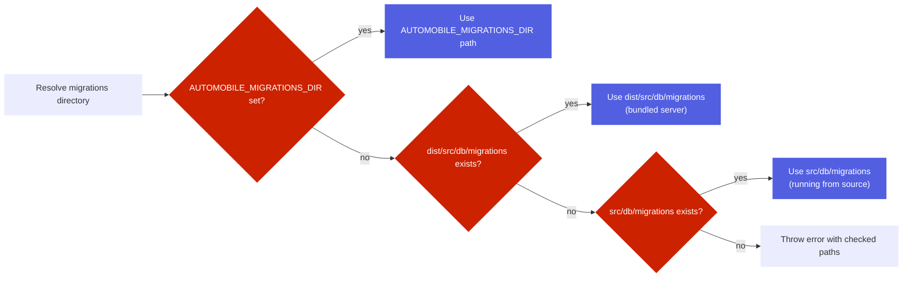

# Migrations

<kbd>✅ Implemented</kbd> <kbd>🧪 Tested</kbd>

> **Current state:** Migration system with Kysely `FileMigrationProvider` is fully implemented. 32+ migrations run automatically on server startup. See the [Status Glossary](../../status-glossary.md) for chip definitions.

AutoMobile uses SQLite migrations to keep the MCP server schema up to date across releases.
Migrations run on server startup and are managed with Kysely's `Migrator` + `FileMigrationProvider`.

## Layout

- Source migrations live in `src/db/migrations` as TypeScript files.
- Build output copies them to `dist/src/db/migrations` so the runtime can load them from disk.

## Naming and ordering convention

Kysely's `Migrator` + `FileMigrationProvider` applies migrations in **lexical filename
order** — the filename is the only ordering key. Every migration must be named:

```
YYYY_MM_DD_NNN_description.ts
```

- `YYYY_MM_DD` is the date the migration was authored.
- `NNN` is a zero-padded sequence number, starting at `000` and incrementing for each
  additional migration authored on the same date (`000`, `001`, `002`, ...).
- `description` is lowercase `snake_case`.

The full `YYYY_MM_DD_NNN` prefix must be **unique across all migrations**. When two
files share a prefix, their relative apply order is decided only by the incidental
alphabetical order of the description — a rebase or a new file inserted into the shared
prefix can silently change apply order, and `migrateToLatest()` throws
`corrupted migrations` whenever an unexecuted migration sorts before an executed one,
wedging startup on populated databases (issue #2868). Before adding a migration, check
for an existing file with the same date and take the next free `NNN`.

**Never rename a migration that has shipped.** Executed migration filenames are recorded
in the `kysely_migration` table, so a rename makes Kysely see the recorded name as
missing and the new name as pending — `corrupted migrations` on every already-populated
database.

Eight historical files (four prefix pairs: `2026_01_03_000`, `2026_01_11_000`,
`2026_01_27_000`, `2026_07_03_000`) shipped with duplicate prefixes before this
convention was enforced. They are frozen as-is — renaming
them would trip the corruption path above — and are grandfathered in
`test/db/migrationFilenameOrdering.ts` (`GRANDFATHERED_PREFIX_COLLISIONS`, a
shrink-only allowlist). The guard test `test/db/migrationFilenameOrdering.test.ts`
scans `src/db/migrations/` and fails on any malformed filename or any **new** prefix
collision.

## Resolution rules

The migration directory is resolved in this order:



If no folder is found, the server throws an error describing the checked paths.

## Docker notes

The Docker image runs the bundled server from `dist/src/index.js`, so migrations must be present
in `dist/src/db/migrations`. The build pipeline copies migrations into `dist` to satisfy this.

## Related code

- `src/db/migrator.ts` resolves the migration folder and runs migrations.
- `build.ts` copies migrations into `dist` during `bun run build`.
