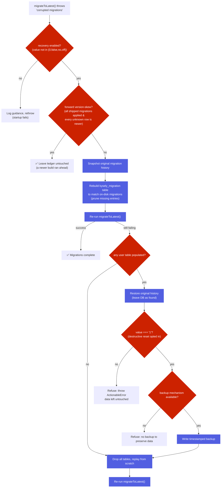
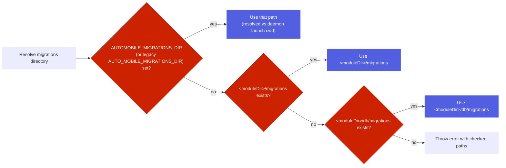

# Migrations

<kbd>✅ Implemented</kbd> <kbd>🧪 Tested</kbd>

> **Current state:** Migration system with Kysely `FileMigrationProvider` is fully implemented. 32+ migrations run automatically on server startup. See the [Status Glossary](../../status-glossary.md) for chip definitions.

AutoMobile uses SQLite migrations to keep the MCP server schema up to date across releases.
Migrations run on server startup and are managed with Kysely's `Migrator` + `FileMigrationProvider`.

## Layout

- Source migrations live in `src/db/migrations` as TypeScript files.
- Build output copies them to `dist/src/db/migrations` so the runtime can load them from disk.

## Naming and ordering convention

Kysely's `Migrator` + `FileMigrationProvider` applies migrations in **lexical filename
order** — the filename is the only ordering key. Every migration must be named:

```
YYYY_MM_DD_NNN_description.ts
```

- `YYYY_MM_DD` is the date the migration was authored.
- `NNN` is a zero-padded sequence number, starting at `000` and incrementing for each
  additional migration authored on the same date (`000`, `001`, `002`, ...).
- `description` is lowercase `snake_case`.

The full `YYYY_MM_DD_NNN` prefix must be **unique across all migrations**. When two
files share a prefix, their relative apply order is decided only by the incidental
alphabetical order of the description — a rebase or a new file inserted into the shared
prefix can silently change apply order, and `migrateToLatest()` throws
`corrupted migrations` whenever an unexecuted migration sorts before an executed one,
wedging startup on populated databases (issue #2868). Before adding a migration, check
for an existing file with the same date and take the next free `NNN`.

**Never rename a migration that has shipped.** Executed migration filenames are recorded
in the `kysely_migration` table, so a rename makes Kysely see the recorded name as
missing and the new name as pending — `corrupted migrations` on every already-populated
database.

Eight historical files (four prefix pairs: `2026_01_03_000`, `2026_01_11_000`,
`2026_01_27_000`, `2026_07_03_000`) shipped with duplicate prefixes before this
convention was enforced. They are frozen as-is — renaming
them would trip the corruption path above — and are grandfathered in
`test/db/migrationFilenameOrdering.ts` (`GRANDFATHERED_PREFIX_COLLISIONS`, a
shrink-only allowlist). The guard test `test/db/migrationFilenameOrdering.test.ts`
scans `src/db/migrations/` and fails on any malformed filename or any **new** prefix
collision.

## Corrupted-migration recovery

When `migrateToLatest()` throws `corrupted migrations` (an unexecuted migration
sorts before an already-executed one — see the ordering convention above),
`src/db/migrator.ts` can attempt an automatic, self-healing recovery instead of
wedging startup. Recovery is gated by the `AUTOMOBILE_MIGRATION_RECOVERY`
environment variable (legacy alias: `AUTO_MOBILE_MIGRATION_RECOVERY`).

### `AUTOMOBILE_MIGRATION_RECOVERY` semantics

The gate is **two-tier** — a value can enable the safe rebuild while still
refusing the destructive reset. This is deliberate: `true` should not silently
drop a user's data.

| Value                                             | Safe history rebuild | Destructive reset of a **populated** DB       |
| ------------------------------------------------- | -------------------- | --------------------------------------------- |
| _(unset)_                                         | ✅ enabled (default) | ❌ refused                                    |
| `true`, `yes`, `on`, or any other non-falsy value | ✅ enabled           | ❌ refused                                    |
| `1`                                               | ✅ enabled           | ✅ allowed (timestamped backup written first) |
| `0`, `false`, `no`, `off`                         | ❌ disabled          | ❌ refused                                    |

- **Safe rebuild is enabled by default** and by any non-falsy value. The
  destructive reset requires an **explicit `1`** — merely non-falsy is not
  enough. So `AUTOMOBILE_MIGRATION_RECOVERY=true` keeps the safe rebuild on but
  **refuses** to drop a populated database; only `=1` opts into the destructive
  reset.
- Values are trimmed and compared case-insensitively; the disabled set is
  `{0, false, no, off}`.

### Recovery flow



Key properties:

- **Forward version-skew is a no-op (issue #5684).** Before any rebuild, if every
  migration this build ships is already applied and the only unrecognized ledger
  rows are lexically newer than the newest migration it knows, a _newer_ build
  migrated this shared database ahead of this one. The ledger is left completely
  untouched. Pruning those newer rows is what makes the newer daemon re-run them
  on its next start, so two builds alternating on one `~/.auto-mobile` DB would
  otherwise churn the history back and forth indefinitely.
- **Safe first.** The rebuild only rewrites the `kysely_migration` bookkeeping
  table to match the migrations actually on disk; user data is not touched. Most
  corruption from a pruned/renamed migration is resolved here.
- **Data is never dropped implicitly.** If the rebuild is insufficient and the
  database has populated user tables, the original migration history is restored
  first, so a refusal leaves the database exactly as it was found — no
  post-refusal wedge once the operator fixes the migration branch.
- **Destructive reset is doubly guarded.** It runs only when
  `AUTOMOBILE_MIGRATION_RECOVERY=1` **and** a backup mechanism is available; the
  timestamped backup is written before any table is dropped.
- **Preferred fix.** Recovery is a safety net, not a substitute for fixing the
  underlying migration ordering/name. The refusal message points the operator at
  the real fix (correct the out-of-order or renamed migration).

## Resolution rules

The migration directory is resolved in this order:



The candidates are resolved **relative to the compiled module's directory**
(`<moduleDir>` = `path.dirname(fileURLToPath(import.meta.url))`), not against the
literal `dist/src/db/migrations` / `src/db/migrations` project paths — so the
bundled `dist/src/index.js` finds its migrations via `<moduleDir>/db/migrations`.
The env override accepts the current `AUTOMOBILE_MIGRATIONS_DIR` and the
deprecated `AUTO_MOBILE_MIGRATIONS_DIR` alias. See `resolveMigrationFolder` in
`src/db/migrator.ts`. If no folder is found, the server throws an error
describing the checked paths.

## Docker notes

The Docker image runs the bundled server from `dist/src/index.js`, so migrations must be present
in `dist/src/db/migrations`. The build pipeline copies migrations into `dist` to satisfy this.

## Related code

- `src/db/migrator.ts` resolves the migration folder and runs migrations.
- `build.ts` copies migrations into `dist` during `bun run build`.
