# AutoMobile Android SDK

<kbd>✅ Implemented</kbd> <kbd>🧪 Tested</kbd>

> **Current state:** `android/auto-mobile-sdk/` is a published Android library providing navigation tracking (Navigation3, Circuit adapters), crash/ANR/handled-exception capture, Compose recomposition tracking, per-frame performance metrics (fps/frame-time/jank via `FrameMetricsCollector`, streamed for observe `perfSnapshot` — #5076), network interception with mock rules, log filtering, notification triggering, biometric stubbing, click tracking, OS event monitoring, SQLite database inspection, and SharedPreferences inspection. All subsystems are initialized through `AutoMobileSDK.initialize()`. Event-producing subsystems communicate with the control-proxy accessibility service via scoped `Intent` broadcasts, while storage inspection (database and SharedPreferences) uses debug-only `ContentProvider` entrypoints. See the [Status Glossary](../../status-glossary.md) for chip definitions.

## Architecture Overview

```mermaid
graph TD
    subgraph App Process
        SDK["AutoMobileSDK<br/>(singleton entry point)"]:::client
        CFG["AutoMobileConfiguration<br/>(builder pattern)"]:::client
        CTX["SdkContext<br/>(appVersion, userId, tags)"]:::core
        BUF["SdkEventBuffer<br/>(batched, thread-safe)"]:::core
        PERSIST["FileEventPersistence<br/>(disk-first durability)"]:::core
        BCAST["SdkEventBroadcaster<br/>(Intent broadcast)"]:::core
        SESSION["SessionTracker<br/>(foreground/background)"]:::core
        CRUMBS["BreadcrumbTrail<br/>(ring buffer)"]:::core

        SDK --> CFG
        SDK --> CTX
        SDK --> BUF
        BUF --> PERSIST
        BUF --> BCAST
        SDK --> SESSION
        SDK --> CRUMBS
    end

    subgraph Subsystems
        NAV["Navigation Adapters"]:::client
        CRASH["AutoMobileCrashes"]:::client
        FAIL["AutoMobileFailures"]:::client
        ANR["AutoMobileAnr"]:::client
        NET["AutoMobileNetwork"]:::client
        LOG["AutoMobileLog"]:::client
        COMPOSE["RecompositionTracker"]:::client
        NOTIF["AutoMobileNotifications"]:::client
        BIO["AutoMobileBiometrics"]:::client
        CLICK["AutoMobileClickTracker"]:::client
        OS["AutoMobileOsEvents"]:::client
        BCINT["AutoMobileBroadcastInterceptor"]:::client
        DB["DatabaseInspector"]:::client
        SP["SharedPreferencesInspector"]:::client
    end

    CTRL["control-proxy<br/>AccessibilityService"]:::external

    BCAST -->|"scoped Intent"| CTRL
    CRASH -->|"crash Intent"| CTRL
    FAIL -->|"handled exception Intent"| CTRL
    ANR -->|"ANR Intent"| CTRL
    COMPOSE -->|"snapshot Intent"| CTRL

    classDef client fill:#CC2200,color:#fff
    classDef core fill:#525FE1,color:#fff
    classDef external fill:#007A3D,color:#fff
```



## 1. Configuration

`AutoMobileConfiguration` uses a builder pattern with validated defaults.

| Parameter          | Default   | Description                                   |
| ------------------ | --------- | --------------------------------------------- |
| `bufferSize`       | 50        | Maximum events before forced flush            |
| `flushIntervalMs`  | 500 ms    | Periodic flush interval                       |
| `maxBreadcrumbs`   | 100       | Ring buffer capacity for breadcrumbs          |
| `sessionTimeoutMs` | 30,000 ms | Background inactivity before session rotation |

```kotlin
val config = AutoMobileConfiguration.Builder()
    .bufferSize(100)
    .flushIntervalMs(1000)
    .maxBreadcrumbs(200)
    .sessionTimeoutMs(60_000)
    .build()

AutoMobileSDK.initialize(applicationContext, config)
```

All builder parameters are validated with `require(value > 0)` at build time.

| Component                         | Description                                                                               | Status                    |
| --------------------------------- | ----------------------------------------------------------------------------------------- | ------------------------- |
| `AutoMobileConfiguration`         | Builder-pattern config with validated defaults                                            | <kbd>✅ Implemented</kbd> |
| `AutoMobileConfiguration.Builder` | Fluent builder with `bufferSize`, `flushIntervalMs`, `maxBreadcrumbs`, `sessionTimeoutMs` | <kbd>✅ Implemented</kbd> |

### Capability discovery and policy

`AutoMobileSDK.capabilities` returns a versioned, machine-readable snapshot of the integration.
Each descriptor has a stable identifier, an availability state, and an optional reason. The
states distinguish `NOT_INITIALIZED`, `DISABLED`, `UNSUPPORTED`, `PERMISSION_DENIED`, `SUPPORTED`,
and `UNKNOWN`.

Host integrations can register and remove optional descriptors with
`registerCapability()` and `unregisterCapability()`. Capture and mutation controls are replaced
atomically through `updateCapturePolicy()`. Header and body capture default to disabled, and
mutation access is rejected unless the host explicitly registers the capability for the operation:
`storage.mutation` for storage providers or `network.control` for network mocks and error
simulation. The default descriptors cover navigation and lifecycle events, network capture, and
storage reads; optional UI, control, and storage-mutation capabilities start as unsupported.

## 2. Initialization and Lifecycle

`AutoMobileSDK` is a Kotlin `object` (singleton). Initialization is split into two phases:

1. **Immediate (any thread):** event buffer, disk persistence, SDK context, thread-safe subsystems (network, logging, crashes, failures, ANR, biometrics, database, SharedPreferences, breadcrumbs).
2. **Main thread (posted via Handler):** lifecycle observers, activity callbacks, recomposition tracker, notifications, click tracker, OS events.

Shutdown cancels pending main-thread work, tears down OS events, broadcast interceptor, click tracker, session tracker, and event buffer. Note: the crash handler (`AutoMobileCrashes`) and biometric override are **not** uninstalled by `shutdown()` — they persist for the process lifetime.

| Component                    | Description                                                                                                                                               | Status                    |
| ---------------------------- | --------------------------------------------------------------------------------------------------------------------------------------------------------- | ------------------------- |
| `AutoMobileSDK.initialize()` | Two-phase init: immediate + main-thread posted                                                                                                            | <kbd>✅ Implemented</kbd> |
| `AutoMobileSDK.shutdown()`   | Tears down OS events, broadcast interceptor, click tracker, session tracker, and event buffer; does not uninstall the crash handler or biometric override | <kbd>✅ Implemented</kbd> |
| `AutoMobileSDK.setEnabled()` | Global enable/disable toggle for event tracking                                                                                                           | <kbd>✅ Implemented</kbd> |

## 3. Event Pipeline

Events flow through a disk-first pipeline to survive process death:

```
SdkEventBuffer.add(event)
    --> FileEventPersistence.persist(batch)     // write to disk
    --> SdkEventBroadcaster.broadcastBatch()    // scoped Intent to control-proxy
    --> FileEventPersistence.removeBatch()      // remove on success
```

On next launch, `replayPendingBatches()` re-broadcasts any batches that survived process death, then `cleanup()` removes batches older than 7 days.

**Batch splitting:** if a serialized batch exceeds 100 KB, `SdkEventBroadcaster.splitIntoBatches()` recursively halves the event list to stay under Android's Binder transaction limit.

**Drop tracking:** `DropCounter` records why events were dropped (disabled, shutdown, flush error) via `ConcurrentHashMap<DropReason, AtomicLong>`.

| Component                            | Description                                           | Status                    |
| ------------------------------------ | ----------------------------------------------------- | ------------------------- |
| `SdkEventBuffer`                     | Thread-safe buffer with capacity and timer flush      | <kbd>✅ Implemented</kbd> |
| `SdkEventBroadcaster`                | Serializes batches as JSON, sends scoped Intents      | <kbd>✅ Implemented</kbd> |
| `FileEventPersistence`               | One JSON file per batch, FIFO ordering, 7-day cleanup | <kbd>✅ Implemented</kbd> |
| `EventPersistence`                   | Interface for disk persistence (testable with fakes)  | <kbd>✅ Implemented</kbd> |
| `DropCounter` / `DefaultDropCounter` | Tracks dropped events by reason                       | <kbd>✅ Implemented</kbd> |

## 4. Context

`SdkContext` holds ambient state attached to SDK events. Thread-safe via `ReentrantLock`.

| Field        | Description                                           |
| ------------ | ----------------------------------------------------- |
| `sessionId`  | Current session UUID (set by `SessionTracker`)        |
| `userId`     | User identifier (set via `AutoMobileSDK.setUserId()`) |
| `appVersion` | From `PackageManager` at init time                    |
| `tags`       | Arbitrary key-value pairs (set/remove via SDK)        |

`SdkContextSnapshot` provides an immutable point-in-time copy via `snapshot()`.

| Component            | Description                                                               | Status                    |
| -------------------- | ------------------------------------------------------------------------- | ------------------------- |
| `SdkContext`         | Thread-safe mutable context with `@Volatile` fields and lock-guarded tags | <kbd>✅ Implemented</kbd> |
| `SdkContextSnapshot` | Immutable data class snapshot                                             | <kbd>✅ Implemented</kbd> |

## 5. Session Tracking

`SessionTracker` manages session lifecycle based on foreground/background transitions via `ProcessLifecycleOwner`.

- **New session:** created on first `onForeground()` or after timeout expires while backgrounded.
- **Background timeout:** configurable via `sessionTimeoutMs` (default 30 s). When the app is backgrounded, a timer starts. If the app returns to foreground before the timer fires, the session continues. Otherwise the session ends and a new one starts on next foreground.
- **Testing:** injectable `uuidProvider` and `timerFactory` for deterministic tests with `FakeTimer`.

| State          | Transition                                          |
| -------------- | --------------------------------------------------- |
| `ENDED`        | `onForeground()` creates new session UUID           |
| `ACTIVE`       | `onBackground()` starts timeout timer               |
| `BACKGROUNDED` | `onForeground()` resumes; timeout fires session end |

| Component         | Description                                               | Status                    |
| ----------------- | --------------------------------------------------------- | ------------------------- |
| `SessionTracker`  | Foreground/background lifecycle with configurable timeout | <kbd>✅ Implemented</kbd> |
| `SessionTracking` | Interface for testability                                 | <kbd>✅ Implemented</kbd> |

## 6. Breadcrumbs

`BreadcrumbTrail` is a thread-safe ring buffer (default capacity 100) of recent app activity. When full, the oldest breadcrumb is evicted.

Breadcrumbs are automatically added for:

- Navigation events
- Custom events (`trackEvent()`)
- Manual calls to `addBreadcrumb()`

Categories: `NAVIGATION`, `TAP`, `LIFECYCLE`, `NETWORK`, `LOG`, `CUSTOM`.

On crash, `AutoMobileCrashes` serializes the breadcrumb snapshot to JSON (capped at 50 KB via binary search) and attaches it to the crash Intent.

| Component            | Description                                                 | Status                    |
| -------------------- | ----------------------------------------------------------- | ------------------------- |
| `BreadcrumbTrail`    | Ring buffer with `ReentrantLock`, evicts oldest on overflow | <kbd>✅ Implemented</kbd> |
| `BreadcrumbTracking` | Interface for testability                                   | <kbd>✅ Implemented</kbd> |
| `Breadcrumb`         | Data class with timestamp, category, message, metadata      | <kbd>✅ Implemented</kbd> |

## 7. Navigation

### Events and Listeners

`NavigationEvent` carries destination, source, arguments, and metadata. `NavigationListener` is a `fun interface` for in-process observers. Events are also routed through the event buffer for cross-process delivery.

Sources: `NAVIGATION_COMPONENT`, `COMPOSE_NAVIGATION`, `CIRCUIT`, `CUSTOM`, `DEEP_LINK`, `ACTIVITY`.

### Framework Adapters

All adapters implement `NavigationFrameworkAdapter` (start/stop/isActive).

| Adapter              | Framework              | Integration                                                        |
| -------------------- | ---------------------- | ------------------------------------------------------------------ |
| `Navigation3Adapter` | `androidx.navigation3` | `@Composable TrackNavigation(destination)` in each `entry<>` block |
| `CircuitAdapter`     | Slack Circuit          | Manual `trackNavigation(destination)` call                         |

`Navigation3Adapter` auto-starts on first composable use and supports argument/metadata extraction lambdas. Both adapters delegate to `AutoMobileSDK.notifyNavigationEvent()`.

| Component                    | Description                                              | Status                    |
| ---------------------------- | -------------------------------------------------------- | ------------------------- |
| `NavigationEvent`            | Data class with destination, source, arguments, metadata | <kbd>✅ Implemented</kbd> |
| `NavigationListener`         | `fun interface` for in-process navigation observers      | <kbd>✅ Implemented</kbd> |
| `NavigationFrameworkAdapter` | Base interface for framework adapters                    | <kbd>✅ Implemented</kbd> |
| `Navigation3Adapter`         | Composable integration for `androidx.navigation3`        | <kbd>✅ Implemented</kbd> |
| `CircuitAdapter`             | Manual tracking for Slack Circuit                        | <kbd>✅ Implemented</kbd> |

## 8. Crash and Failure Handling

### Unhandled Crashes (`AutoMobileCrashes`)

Installs an `UncaughtExceptionHandler` that:

1. Captures exception class, message, full stack trace (including all-thread dump, capped at 50 KB).
2. Collects device info (`Build.MODEL`, `MANUFACTURER`, `VERSION`), app version, current screen.
3. Serializes breadcrumb trail snapshot.
4. Broadcasts a scoped Intent to the control-proxy accessibility service.
5. Calls the original handler to preserve default crash behavior.
6. Sleeps 200 ms to allow broadcast dispatch before process termination.

### Handled Exceptions (`AutoMobileFailures`)

Reports non-fatal exceptions that were caught and recovered from. Stores up to 100 recent events in an in-memory `ArrayDeque` and broadcasts each to the control-proxy.

### ANR Detection (`AutoMobileAnr`)

Uses `ApplicationExitInfo` API (Android 11+, API 30) to detect ANRs from previous sessions on app restart. Persists the last reported timestamp in `SharedPreferences` to avoid duplicate reporting. Reads ANR traces from `exitInfo.traceInputStream`.

| Component               | Description                                                     | Status                    |
| ----------------------- | --------------------------------------------------------------- | ------------------------- |
| `AutoMobileCrashes`     | `UncaughtExceptionHandler` with all-thread dump and breadcrumbs | <kbd>✅ Implemented</kbd> |
| `AutoMobileFailures`    | Non-fatal exception recording and broadcast                     | <kbd>✅ Implemented</kbd> |
| `HandledExceptionEvent` | Data class for handled exception details                        | <kbd>✅ Implemented</kbd> |
| `AutoMobileAnr`         | `ApplicationExitInfo`-based ANR detection (API 30+)             | <kbd>✅ Implemented</kbd> |

## 9. Network Interception

### HTTP Interception (`AutoMobileNetwork`)

Provides an OkHttp `Interceptor` via `AutoMobileNetwork.interceptor()`. Events are routed through `SdkEventBuffer`. Optional header and body capture (disabled by default for privacy, bodies truncated to 32 KB).

### WebSocket Tracking

`AutoMobileNetwork.wrapWebSocketListener()` wraps an existing `WebSocketListener` to capture frame metadata (direction, type, payload size).

OkHttp is a `compileOnly` dependency -- consumers must include it themselves.

### Mock Rules (`NetworkMockRuleStore`)

Thread-safe store for mock rules and error simulation config, updated via broadcast from the control-proxy process. Rules use compiled regex for host/path matching with optional request limits. Error simulation supports typed errors with TTL and request count limits.

The `RuleMatcher` interface decouples the interceptor from the full store.

| Component                          | Description                                                           | Status                    |
| ---------------------------------- | --------------------------------------------------------------------- | ------------------------- |
| `AutoMobileNetwork`                | OkHttp interceptor factory and WebSocket wrapper                      | <kbd>✅ Implemented</kbd> |
| `AutoMobileNetworkInterceptor`     | Application-level interceptor with mock rule enforcement              | <kbd>✅ Implemented</kbd> |
| `AutoMobileWebSocketListener`      | WebSocket frame metadata capture                                      | <kbd>✅ Implemented</kbd> |
| `NetworkMockRuleStore`             | Broadcast-updated rule store with regex matching and error simulation | <kbd>✅ Implemented</kbd> |
| `NetworkMockRuleStore.RuleMatcher` | Decoupled interface for interceptor queries                           | <kbd>✅ Implemented</kbd> |

## 10. Logging

`AutoMobileLog` is a drop-in replacement for `android.util.Log` that also checks registered filters and posts matching entries to the event buffer.

- **Zero overhead** when no filters are registered: a single `filters.isEmpty()` check.
- **First-match semantics:** only records once per log call.
- Filter matching order (cheapest first): level, tag regex, message regex.

```kotlin
AutoMobileLog.addFilter(
    name = "crash-related",
    tagPattern = Regex("Crash|Fatal"),
    minLevel = Log.ERROR,
)
```

| Component           | Description                                                | Status                    |
| ------------------- | ---------------------------------------------------------- | ------------------------- |
| `AutoMobileLog`     | `android.util.Log` drop-in with filter-based event capture | <kbd>✅ Implemented</kbd> |
| `CompiledLogFilter` | Pre-compiled regex filter with level/tag/message matching  | <kbd>✅ Implemented</kbd> |

## 11. Storage Inspection

### Database Inspection (`DatabaseInspector`)

Provides SQLite database access for debug builds. Disabled by default; must be explicitly enabled. Uses a lazy `SQLiteDatabaseDriver` that opens databases on demand. Closes all connections on disable or app destruction.

### SharedPreferences Inspection (`SharedPreferencesInspector`)

Provides SharedPreferences read access for debug builds. Same enable/disable pattern as `DatabaseInspector`. Uses a lazy `SharedPreferencesDriverImpl` with change listeners.

Both inspectors follow the pattern: `initialize(context)` at SDK init, `setEnabled(true)` in debug builds, lazy driver creation on first access.

### DataStore Inspection (`DataStoreInspector`)

Storage inspection is otherwise blind to applications that keep preferences in [Jetpack DataStore](https://developer.android.com/topic/libraries/architecture/datastore) rather than conventional `SharedPreferences` files. `DataStoreInspector` closes that gap with an explicit, read-only, application-provided adapter contract so DataStore state is inspected through a documented interface instead of by inferring it from implementation-specific files (#5192).

**Integration contract.** The host implements `DataStoreAdapter` against its own DataStore instances — typically `androidx.datastore.core.DataStore<androidx.datastore.preferences.core.Preferences>` — and registers it under a stable name:

```kotlin
class AppDataStoreAdapter(
  private val stores: Map<String, DataStore<Preferences>>,
) : DataStoreAdapter {
  override suspend fun storeNames(): List<String> = stores.keys.toList()

  override suspend fun read(storeName: String): List<DataStoreEntry> {
    val store = stores[storeName] ?: throw DataStoreAdapterError.StoreNotFound(storeName)
    return store.data.first().asMap().map { (key, value) ->
      DataStoreEntry(key.name, value, valueTypeOf(value))
    }
  }

  private fun valueTypeOf(value: Any?): DataStoreValueType =
    when (value) {
      is String -> DataStoreValueType.STRING
      is Int -> DataStoreValueType.INT
      is Long -> DataStoreValueType.LONG
      is Float -> DataStoreValueType.FLOAT
      is Double -> DataStoreValueType.DOUBLE
      is Boolean -> DataStoreValueType.BOOLEAN
      is Set<*> -> DataStoreValueType.STRING_SET
      is ByteArray -> DataStoreValueType.BYTE_ARRAY
      else -> DataStoreValueType.UNKNOWN
    }
}

if (BuildConfig.DEBUG) {
  SharedPreferencesInspector.setEnabled(true) // shared storage-surface enable switch
  // Retain the returned handle for registration-scoped teardown (see Lifecycle-safe below).
  val registration = DataStoreInspector.registerAdapter("app", AppDataStoreAdapter(stores))
  // ... later, when this owner is torn down:
  registration.unregister() // removes only if it has not since been replaced
}
```

DataStore-backed preferences are then discoverable and readable through the existing storage `ContentProvider` (`listDataStores`, `getDataStore`), reusing the same `StorageResponse` shapes as SharedPreferences. Stores are identified by name only — **no filesystem path is ever exposed** — and served via `adb shell content call ... --method getDataStore --extra adapterName:s:app --extra storeName:s:settings`.

**Boundary guarantees** (enforced by `DataStoreInspector`, independent of the host adapter):

- **Read-only.** The `DataStoreAdapter` contract exposes no mutation entry point, so mutation is structurally unsupported; `capabilities().mutationSupported` is always `false`.
- **Redaction.** A configurable `DataStoreRedactionPolicy` (`setRedactionPolicy`) redacts matching values at the boundary before they leave the SDK; a host adapter cannot opt out. A redacted value is replaced with the `DataStoreInspector.REDACTED_VALUE` marker string and its type is set to `STRING` (so the marker survives wire serialization) — redaction never yields a null value.
- **Structured values and errors.** Values map onto `DataStoreValueType` (String, Int, Long, Float, Double, Boolean, `Set<String>`, byte array); an unrepresentable value is surfaced as `UNKNOWN` or rejected with `DataStoreAdapterError.UnsupportedValue`. Missing adapters/stores and host read failures surface as `AdapterNotFound`, `StoreNotFound`, and `ReadError`.
- **Lifecycle-safe.** Registration replaces by name and returns an `InspectorRegistration` handle. For registration-scoped teardown, keep that handle and call `registration.unregister()` — it removes the adapter **only if it has not since been replaced** under the same name, so a stale owner cannot tear down a newer owner's replacement. The name-based `unregisterAdapter(name)` removes whatever is currently registered under that name (use it only when you own the name unconditionally). `AutoMobileSDK.shutdown()` clears all adapters. Reads run in the caller's coroutine context, so cancellation propagates cooperatively and no background coroutines or listeners are retained.

**Limitations.** Read-only by design (no writes). Change subscriptions/listeners are not part of the contract (unlike `SharedPreferencesInspector`) — reads are point-in-time snapshots. Value redaction operates per key/store name, not on nested structured values. The SDK never links against `androidx.datastore`; representing values is the host adapter's responsibility.

| Component                     | Description                                                                                        | Status                    |
| ----------------------------- | -------------------------------------------------------------------------------------------------- | ------------------------- |
| `DatabaseInspector`           | SQLite database access with lazy driver and enable/disable gating                                  | <kbd>✅ Implemented</kbd> |
| `SQLiteDatabaseDriver`        | Database driver with connection pooling                                                            | <kbd>✅ Implemented</kbd> |
| `DatabaseDriver`              | Interface for testability                                                                          | <kbd>✅ Implemented</kbd> |
| `SharedPreferencesInspector`  | SharedPreferences access with lazy driver and enable/disable gating                                | <kbd>✅ Implemented</kbd> |
| `SharedPreferencesDriverImpl` | SharedPreferences driver with change listeners                                                     | <kbd>✅ Implemented</kbd> |
| `SharedPreferencesDriver`     | Interface for testability                                                                          | <kbd>✅ Implemented</kbd> |
| `DataStoreInspector`          | Read-only DataStore access via app-provided adapters, boundary redaction, and capability reporting | <kbd>✅ Implemented</kbd> |
| `DataStoreAdapter`            | Application-provided read-only DataStore integration contract                                      | <kbd>✅ Implemented</kbd> |

## 12. Compose Recomposition Tracking

Three layers work together:

### `ComposeRecomposition` (API Surface)

- `Modifier.autoMobileRecomposition(id, ...)` -- modifier that records recompositions with optional metadata (composable name, resource ID, test tag, parent chain, stability annotations, likely cause).
- `TrackRecomposition(id, ...) { content }` -- composable wrapper that also measures composition duration via `System.nanoTime()`.
- `Modifier.autoMobileRecompositionId(id)` -- lightweight semantics-only marker.

### `ComposeObservableApi` (Cause Tracking)

`EnableComposeObservableApi()` composable hooks into Compose's `CompositionObserver`/`CompositionRegistrationObserver` APIs to detect invalidation causes. The `ObservableRecompositionBridge` maps `RecomposeScope` to invalidation causes: `state_read`, `unstable_lambda`, `collection_change`, or `unknown`.

### `RecompositionTracker` (Aggregation and Broadcast)

Singleton that aggregates recomposition counts with a 1-second rolling average window. Broadcasts JSON snapshots to the control-proxy every 1 second when enabled. Controlled remotely via broadcast intent. Each entry tracks: total count, skip count, rolling 1s average, composable name, resource ID, test tag, parent chain, stability annotation, remembered count, likely cause, and average duration.

| Component                       | Description                                              | Status                    |
| ------------------------------- | -------------------------------------------------------- | ------------------------- |
| `ComposeRecomposition`          | Modifier and composable APIs for recomposition tracking  | <kbd>✅ Implemented</kbd> |
| `TrackRecomposition`            | Composable wrapper with optional duration measurement    | <kbd>✅ Implemented</kbd> |
| `ComposeObservableApi`          | Compose runtime observer for invalidation cause tracking | <kbd>✅ Implemented</kbd> |
| `ObservableRecompositionBridge` | Maps `RecomposeScope` to invalidation cause strings      | <kbd>✅ Implemented</kbd> |
| `RecompositionTracker`          | Aggregation with rolling average and periodic broadcast  | <kbd>✅ Implemented</kbd> |

## 13. Other Subsystems

### Notifications (`AutoMobileNotifications`)

Posts notifications from the app-under-test process. Supports DEFAULT, BIG_TEXT, and BIG_PICTURE styles. Handles image loading from file paths, content URIs, and base64 data. Creates notification channels automatically on Android O+.

| Component                 | Description                                                 | Status                    |
| ------------------------- | ----------------------------------------------------------- | ------------------------- |
| `AutoMobileNotifications` | Notification posting with multiple styles and image sources | <kbd>✅ Implemented</kbd> |

### Biometric Stubbing (`AutoMobileBiometrics`)

Provides deterministic biometric testing by injecting known `BiometricResult` values (Success, Failure, Cancel, Error) via broadcast. Overrides have a configurable TTL (default 5 s) and are consumed atomically.

| Component              | Description                                              | Status                    |
| ---------------------- | -------------------------------------------------------- | ------------------------- |
| `AutoMobileBiometrics` | Biometric override injection via broadcast with TTL      | <kbd>✅ Implemented</kbd> |
| `BiometricResult`      | Sealed class: Success, Failure, Cancel, Error(errorCode) | <kbd>✅ Implemented</kbd> |

### Click Tracking (`AutoMobileClickTracker`)

Automatic tap tracking for all Activities via `Window.Callback` delegation. On ACTION_UP (when the gesture is a tap, not a drag), finds the tapped element via the accessibility node tree and emits an `_auto_tap` custom event with coordinates, text, content description, resource ID, class name, and clickability. Debounced at 100 ms. Works with Compose, XML Views, React Native, and Flutter.

| Component                | Description                                          | Status                    |
| ------------------------ | ---------------------------------------------------- | ------------------------- |
| `AutoMobileClickTracker` | Window.Callback delegation for automatic tap capture | <kbd>✅ Implemented</kbd> |

### OS Events (`AutoMobileOsEvents`)

Registers low-overhead listeners for system events and posts `SdkLifecycleEvent` to the buffer:

- **Foreground/background** via `ProcessLifecycleOwner`
- **Activity lifecycle** (created/started/resumed/paused/stopped/destroyed) via `ActivityLifecycleCallbacks`
- **Connectivity changes** (wifi/cellular/ethernet) via `ConnectivityManager.NetworkCallback`
- **Battery changes** (level/charging, deduplicated) via `BroadcastReceiver`
- **Screen on/off** via `BroadcastReceiver`

| Component            | Description                                                          | Status                    |
| -------------------- | -------------------------------------------------------------------- | ------------------------- |
| `AutoMobileOsEvents` | Foreground, activity lifecycle, connectivity, battery, screen events | <kbd>✅ Implemented</kbd> |

### Broadcast Interceptor (`AutoMobileBroadcastInterceptor`)

Intercepts a curated set of system broadcasts (locale changed, timezone changed, screen on/off, user present, package added/removed) and records them as `SdkBroadcastEvent`. Only captures action, categories, and extra key names with type names (not values) to avoid leaking sensitive data.

| Component                        | Description                                               | Status                    |
| -------------------------------- | --------------------------------------------------------- | ------------------------- |
| `AutoMobileBroadcastInterceptor` | Curated system broadcast capture with privacy-safe extras | <kbd>✅ Implemented</kbd> |

### Testing Utilities

`ConfigurationOverrideHelper` applies configuration overrides in tests (e.g., locale changes) and triggers configuration change callbacks on the activity.

| Component                     | Description                                   | Status                    |
| ----------------------------- | --------------------------------------------- | ------------------------- |
| `ConfigurationOverrideHelper` | Test-only configuration override for Activity | <kbd>✅ Implemented</kbd> |

## See Also

- [JUnitRunner](junit-runner/index.md) -- test execution framework
- [Control Proxy (AccessibilityService)](control-proxy.md) -- real-time view hierarchy access
- [Notification Triggering](notifications.md) -- MCP tool for SDK notifications
- [Biometrics Stubbing](biometrics.md) -- MCP tool for biometric overrides
- [iOS SDK](../ios/index.md) -- iOS platform equivalent
- [Status Glossary](../../status-glossary.md) -- chip definitions
