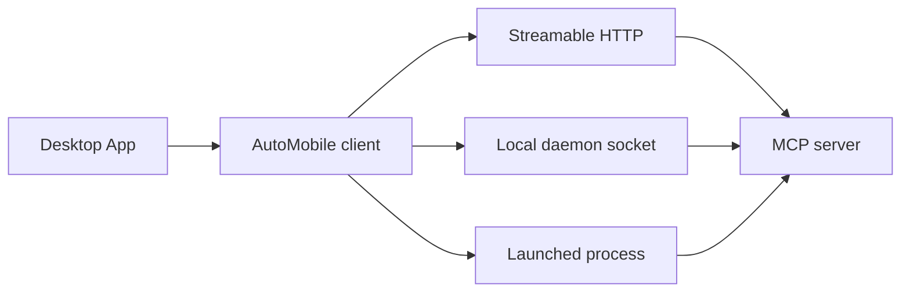

# Desktop App

The AutoMobile Desktop App is a visual workspace for a connected device. Use it when you want to inspect live screens, explore navigation, review failures, or watch performance data without working only through prompts and tool calls.

It connects to AutoMobile automatically and keeps device state, screenshots, and diagnostics in one place. The app is optional: every workflow remains available through the MCP server.

## Connection and device control

The Desktop App automatically uses the available AutoMobile connection, whether that is a local daemon, HTTP server, or launched process. While it is controlling a selected device, that device is reserved for the Desktop App. Close or disconnect the app before using the same device from another agent or CLI session.
