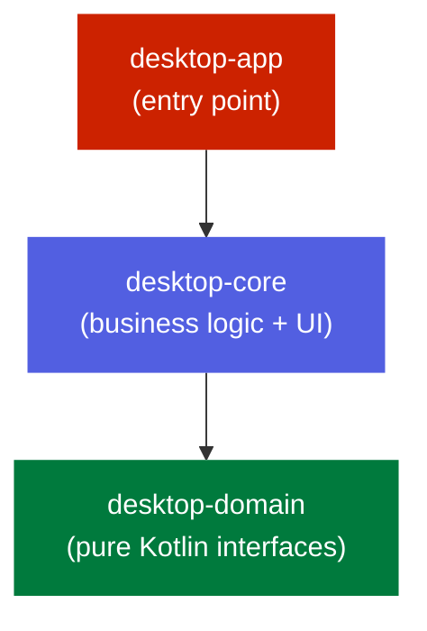
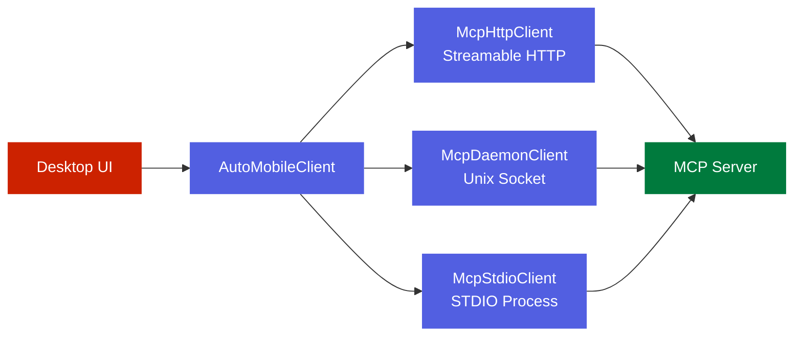

# Desktop Compose UI App

<kbd>✅ Implemented</kbd> <kbd>🧪 Tested</kbd>

> **Current state:** The desktop app is a standalone Compose Desktop application that provides a multi-dashboard UI for device observation, navigation mapping, failure analysis, performance monitoring, layout inspection, storage editing, telemetry, test management, and diagnostics. It communicates with the AutoMobile MCP server via three transport strategies (Streamable HTTP, Unix socket, STDIO). See the [Status Glossary](../../status-glossary.md) for chip definitions.

## Three-Module Architecture

The desktop app is split into three Gradle modules under `android/`:



| Module           | Purpose                                                                      | Key Contents                                                                                                                                          |
| ---------------- | ---------------------------------------------------------------------------- | ----------------------------------------------------------------------------------------------------------------------------------------------------- |
| `desktop-domain` | Pure Kotlin data models with no framework dependencies                       | `NavigationModels`, `FailureModels`, `PerformanceModels`, `LayoutModels`, `StorageModels`, `TestModels`                                               |
| `desktop-core`   | Business logic, daemon clients, data sources, ViewModels, and all Compose UI | `daemon/`, `datasource/`, `failures/`, `navigation/`, `performance/`, `layout/`, `storage/`, `telemetry/`, `test/`, `shell/`, `settings/`, `testing/` |
| `desktop-app`    | Thin entry point: window creation, Metro DI bootstrap, single-instance lock  | `Main.kt`, `AutoMobileDesktopApp.kt`, `AutoMobileGraph.kt`, `AutoMobileTheme.kt`                                                                      |

### desktop-domain

Contains six model files that define the domain vocabulary. All types are plain `data class` or `enum class` with no serialization annotations, keeping this module dependency-free. Highlights:

- `NavigationGraph`, `ScreenNode`, `ScreenTransition` -- graph-based navigation model
- `FailureGroup`, `FailureOccurrence`, `FailureType`, `FailureSeverity` -- failure aggregation
- `PerformanceMetric`, `PerformanceAnomaly`, `PerformanceRun`, `PerformanceThresholds` -- metrics and thresholds
- `UIElementInfo`, `ParsedHierarchy`, `ObservationData`, `ConnectionStatus` -- layout inspection
- `DatabaseInfo`, `KeyValueFile`, `KeyValueEntry` -- on-device storage inspection
- `TestCase`, `TestRun`, `TestStep`, `RecordedAction` -- test management

### desktop-app

The entry point module is intentionally small:

1. **`Main.kt`** -- acquires a file-lock (`automobile-desktop.lock`) to enforce single-instance, creates the Metro `AutoMobileGraph`, sets macOS native transparent title bar properties, and launches a 1440x900 Compose window.
2. **`AutoMobileDesktopApp.kt`** -- wraps `AutoMobileContent` (from desktop-core) with an `AutoMobileTheme` and an `ObservableSettingsProvider` that bridges `SettingsProvider` changes into Compose snapshot state.
3. **`AutoMobileTheme.kt`** -- Material 3 color scheme with light and dark variants. Resolves `themeMode` strings (`"dark"`, `"light"`, `"system"`) to the appropriate scheme. Defaults to dark to match the IDE plugin.

## Hot Reload (Development)

The `:desktop-app` module applies [JetBrains Compose Hot Reload](https://github.com/JetBrains/compose-hot-reload) (`org.jetbrains.compose.hot-reload`) so UI changes reflect on the running window without a full restart. This is the Compose-Desktop/JVM-native hot reload path -- distinct from Compose HotSwan, which targets on-device Android apps.

Launch the dashboard in hot-reload mode:

```bash
./gradlew -p android :desktop-app:hotRun --autoReload --no-configuration-cache
```

- The plugin auto-registers `hotRun` (blocking) and `hotDev` (async) tasks for this Kotlin/JVM module -- but **only** because the Compose Multiplatform plugin (`org.jetbrains.compose`) is declared on the root build's classloader in `android/build.gradle.kts` (`alias(libs.plugins.compose.multiplatform) apply false`). The hot-reload plugin gates auto-registration on `Class.forName("org.jetbrains.compose.ComposePlugin")` resolving from its own (root) classloader; applying the Compose plugin only in leaf modules leaves that class invisible to it, it logs `Cannot access 'org.jetbrains.compose' plugin. Was this plugin loaded?`, and no `hotRun` task is created.
- `--no-configuration-cache` is required: the hot-reload run tasks (e.g. `ComposeHotSnapshotTask`) are not configuration-cache serializable, and the repo enables the configuration cache by default. (The inner continuous-build daemon it spawns uses its own configuration cache and is unaffected.)
- `ComposeHotRun.mainClass` is pinned to `dev.jasonpearson.automobile.desktop.MainKt` in `desktop-app/build.gradle.kts`.
- Most composables live in `:desktop-core` (an `implementation` dependency of `:desktop-app`), so editing a dashboard panel there reloads into the running window.
- Requires the JetBrains Runtime (JBR) for enhanced class redefinition; the foojay toolchain resolver in `settings.gradle.kts` provisions a compatible JDK. Java target stays at 21.
- The single-instance file lock in `Main.kt` (`automobile-desktop.lock`) is released on process exit, so hot-reload relaunches do not deadlock.

Normal `:desktop-app:run` and the packaged `nativeDistributions` builds are unaffected -- the plugin only adds the dev-time run tasks.

## DI System

The app uses [Metro](https://github.com/ZacSweers/metro) for compile-time dependency injection.

```
@DependencyGraph(scope = AppScope::class)
interface AutoMobileGraph {
    val autoMobileClient: AutoMobileClient
    val settingsProvider: SettingsProvider

    @DependencyGraph.Factory
    fun interface Factory { fun create(): AutoMobileGraph }
}
```

`ApplicationModule` contributes bindings to `AppScope`:

| Binding            | Provider                                                                                                                                                                                                                      |
| ------------------ | ----------------------------------------------------------------------------------------------------------------------------------------------------------------------------------------------------------------------------- |
| `AutoMobileClient` | `McpClientFactory.createPreferred(null)` -- selects the best available transport                                                                                                                                              |
| `SettingsProvider` | `FileSettingsProvider()` -- persists to `~/.auto-mobile/desktop-settings.properties`, so the first-run onboarding flag and theme survive restarts (`FakeSettingsProvider` remains the in-memory implementation used by tests) |

Scope annotations `@SingleIn(AppScope::class)` ensure singletons live for the app lifecycle.

## Daemon Communication

The desktop app communicates with the AutoMobile MCP server through the `AutoMobileClient` interface, which exposes JSON-RPC methods for MCP resources, tools, device management, observation, and storage operations.



### Unix-daemon session ownership

When the desktop connects to a Unix-socket daemon, `AutoMobileContent` creates one
`DesktopDaemonSession` for that app run. It generates a UUID once and keeps one
long-lived `McpDaemonClient` bound to it. Device-aware main-socket tool calls
automatically carry that UUID (unless a call explicitly supplies another session),
and the selected device is bound with `setActiveDevice` before authenticated stream
clients are exposed.

The WebRTC and H.264 stream clients receive the same UUID through their
`sessionUuidProvider`. This ordering is required because the stream sockets only
read the daemon session registry; they do not create sessions. On daemon disconnect,
transport change, or Compose disposal, the holder sends `daemon/releaseSession` once
so device ownership is reclaimed. While the selected device is bound, the desktop
sends `daemon/heartbeat` every two seconds; this keeps the daemon's default heartbeat
lease alive even when the viewer is idle. A failed release is harmless because the
daemon's normal session-expiry path remains authoritative.

This deliberately gives the desktop exclusive ownership of its selected device while
it is connected. A concurrent CLI or agent receives the daemon's existing
"already assigned" error instead of bypassing ownership. Non-Unix transports retain
their prior behavior, and operators can still use `AUTOMOBILE_DAEMON_STREAM_AUTH=0`
while migrating older clients.

### Transport Implementations

| Client            | Transport                                                  | Session Management      | Retry                                                                          |
| ----------------- | ---------------------------------------------------------- | ----------------------- | ------------------------------------------------------------------------------ |
| `McpHttpClient`   | HTTP POST to `/auto-mobile/streamable`                     | `mcp-session-id` header | `RetryPolicy` with exponential backoff, jitter, retryable error classification |
| `McpDaemonClient` | Unix domain socket at `/tmp/auto-mobile-daemon-{uid}.sock` | Per-request connection  | None (single-shot)                                                             |
| `McpStdioClient`  | stdin/stdout of a spawned child process                    | Persistent process      | None                                                                           |

### McpClientFactory

`McpClientFactory` selects the transport automatically:

1. If an `McpHttpServer` is provided (from discovery), use `McpHttpClient`.
2. If `AUTOMOBILE_MCP_HTTP_URL` env var or system property is set, use `McpHttpClient`.
3. If `AUTOMOBILE_MCP_STDIO_COMMAND` env var or system property is set, use `McpStdioClient`.
4. Fall back to `McpDaemonClient` (Unix socket).

`createFromProcess(McpProcess)` binds a client to a detected running process by its connection type.

### RetryPolicy

`McpHttpClient` uses a configurable `RetryPolicy` for transient failures:

- Max retries: 3
- Initial delay: 1000ms, backoff multiplier: 2x, max delay: 30s
- Jitter fraction: 10%
- Retryable errors: `ConnectException`, `HttpTimeoutException`, HTTP 5xx

### McpHttpDiscovery

Discovers running MCP servers by scanning listening TCP ports and probing `/health` endpoints:

1. `DefaultPortScanner` -- runs `lsof`/`netstat`/`ss` to find listening ports
2. `HttpHealthProbe` -- sends GET to `/health` and `/auto-mobile/health` with 800ms timeout
3. Matches discovered servers against `GitWorktreeLister` output (maps branches to worktrees)
4. Returns `McpDiscoverySnapshot` with `McpServerOption` entries combining server + worktree info

### McpProcessDetector

Detects running AutoMobile processes via `ps` and classifies their connection type (Streamable HTTP, Unix Socket, STDIO) by inspecting command-line arguments and `lsof` output. Uses injectable `ProcessRunner`, `SocketFileChecker`, and `TimeProvider` interfaces for testability.

## Stream Clients

Real-time data flows over Unix domain sockets, separate from the request/response MCP channel:

| Client                               | Socket Path                              | Data                                                                                 |
| ------------------------------------ | ---------------------------------------- | ------------------------------------------------------------------------------------ |
| `ObservationStreamClient`            | `~/.auto-mobile/observation-stream.sock` | Hierarchy updates, screenshot updates, navigation graph updates, performance metrics |
| `FailuresStreamSocketClient`         | Failures socket                          | Failure notifications, groups, timeline data                                         |
| `PerformanceAuditStreamSocketClient` | Performance socket                       | Performance audit poll results                                                       |
| `TelemetryPushSocketClient`          | Telemetry socket                         | Custom telemetry events                                                              |

### ObservationStreamClient

Maintains a persistent connection with subscribe/unsubscribe semantics. Cadence is managed through `setCadence(screenshotIntervalMs, hierarchyIntervalMs)`: when connected it sends an `update_cadence` command so the daemon reconfigures capture in place (no resubscribe, no backfill), and the values are remembered so they are re-applied on the `subscribe` request after any reconnect. The desktop requests a faster screenshot cadence only while the live layout inspector is active (`isLiveLayoutMode`) and relaxes to the daemon default otherwise, avoiding frequent captures the user can't see. The hierarchy cadence is deliberately left unset so each platform keeps its faster hierarchy default (Android 250ms, iOS 1000ms) instead of being slowed to a fixed value. Omitting a field (or an older daemon, which replies with a benign "unknown command" error) falls back to the daemon default. Exposes Kotlin `SharedFlow` instances:

- `hierarchyUpdates: SharedFlow<HierarchyStreamUpdate>`
- `screenshotUpdates: SharedFlow<ScreenshotStreamUpdate>`
- `navigationUpdates: SharedFlow<NavigationGraphStreamUpdate>`
- `performanceUpdates: SharedFlow<PerformanceStreamUpdate>`
- `connectionState: SharedFlow<StreamConnectionState>`

Connection state is modeled as a sealed class: `Connecting`, `Connected`, `Disconnected(reason)`.

## Data Source Layer

Each data domain follows a two-part pattern (interface with Real and Fake implementations). Navigation and AppList additionally use a cached wrapper:

```
Interface  -->  RealXxxDataSource (calls AutoMobileClient)
           -->  FakeXxxDataSource (returns canned data)
           -->  CachedXxxDataSource (wraps delegate with InMemoryCache)  [Navigation, AppList only]
```

| DataSource              | Domain                     | Cache TTL                              |
| ----------------------- | -------------------------- | -------------------------------------- |
| `NavigationDataSource`  | `NavigationGraph`          | 30s (via `CachedNavigationDataSource`) |
| `AppListDataSource`     | `List<InstalledApp>`       | 30s (via `CachedAppListDataSource`)    |
| `LayoutDataSource`      | Layout/observation data    | --                                     |
| `PerformanceDataSource` | Performance metrics        | --                                     |
| `StorageDataSource`     | Key-value files, databases | --                                     |
| `TestDataSource`        | Test cases and runs        | --                                     |
| `FailuresDataSource`    | Failure groups             | --                                     |

### InMemoryCache

A generic TTL-based cache using `ConcurrentHashMap` for lock-free reads and per-key `Mutex` for coalesced fetches. Injectable `clock` lambda enables deterministic testing.

### DataSourceFactory / DataSourceMode

`DataSourceFactory` creates the appropriate data source implementation based on `DataSourceMode` (`Real`, `Fake`), allowing the UI to switch between real server data and demo data.

## Unified Result Type

```kotlin
sealed interface Result<out T> {
    data class Success<T>(val data: T) : Result<T>
    data class Error(val exception: Throwable, val message: String?) : Result<Nothing>
    data object Loading : Result<Nothing>
}
```

The `asResult()` Flow extension wraps any `Flow<T>` into `Flow<Result<T>>`, emitting `Loading` on start and catching exceptions as `Error` (while re-throwing `CancellationException`).

## Dashboard UI

### ThreePaneShell Layout

The top-level layout is an Xcode-inspired three-pane shell with resizable, collapsible panels:

- **Left sidebar** (220dp default) -- device list, app filter, daemon status, MCP connection
- **Center canvas** (flex) -- the active dashboard content, with a status bar at the bottom
- **Right inspector** (300dp default) -- context-sensitive detail panel
- **Bottom timeline** (120dp default) -- collapsible event timeline

Keyboard shortcuts: `Cmd+0` (left), `Cmd+Shift+0` (right), `Cmd+Shift+Y` (bottom), `Tab`/`Shift+Tab` (cycle focus), `Cmd+/` (cheat sheet), `Cmd+K` (quick jump). Optional Vim mode (j/k/g/G//).

### Dashboard Tabs

The center content area uses a split layout. When the Navigation view is active, it fills the center. Otherwise, Telemetry is the primary center content with secondary dashboards available via bottom tabs:

| Dashboard   | Position               | Description                                                            |
| ----------- | ---------------------- | ---------------------------------------------------------------------- |
| Navigation  | Primary (full center)  | Flow map with screen nodes and transitions, canvas view, detail panels |
| Telemetry   | Primary (center top)   | Network request inspector, custom event renderer                       |
| Test        | Secondary (bottom tab) | Test case browser, run history, recording, plan execution              |
| Storage     | Secondary (bottom tab) | SharedPreferences/database inspector, key-value editor                 |
| Diagnostics | Secondary (bottom tab) | System health, daemon status, MCP process list                         |
| Performance | Inspector panel        | Real-time FPS/memory/CPU, anomaly detection, run comparison            |
| Layout      | Inspector panel        | Device screen mirror, hierarchy tree, property inspector               |
| Failures    | Inspector panel        | Grouped failure list, timeline chart, stack trace viewer               |

### ViewModels

Navigation and Failures each have a dedicated ViewModel that manages UI state via `StateFlow` and dispatches one-shot effects via `Channel`. Other dashboards do not yet have standalone ViewModels:

**NavigationViewModel**

- State: `Loading | Content(graph, selectedScreenId, currentSection) | Error(message)`
- Actions: `Refresh`, `SelectScreen`, `SelectScreenByName`, `BackToFlowMap`, `UpdateGraph`
- Effects: `OpenSource(fileName, lineNumber)`

**FailuresViewModel**

- State: `Loading | Content(failureGroups, selectedFailure, filterType) | Error(message)`
- Actions: `Refresh`, `SelectFailure`, `ClearSelection`, `FilterByType`, `SelectFailureById`, `UpdateGroups`
- Effects: `OpenStackTrace`, `NavigateToScreen`, `NavigateToTest`

Both follow the same pattern: sealed `UiState`, sealed `Action`, sealed `Effect`, with the ViewModel accepting a `DataSource` and `CoroutineScope` via constructor injection.

## Testing Strategy

### FakeAutoMobileClient

A reusable fake that records all method calls in a `calls: MutableList<String>` and returns configurable values for every `AutoMobileClient` method. Supports per-URI resource responses via `setResourceResponseWithText()`. Write calls (`setKeyValue`, `removeKeyValue`, `clearKeyValueFile`) are additionally captured in typed call lists for assertion.

### Test Structure

Tests live under `android/desktop-core/src/test/kotlin/` and cover:

| Area              | Test Files                                                                                                                                | Techniques                                                |
| ----------------- | ----------------------------------------------------------------------------------------------------------------------------------------- | --------------------------------------------------------- |
| Daemon clients    | `McpHttpClientCancellationTest`, `McpHttpDiscoveryTest`, `RetryPolicyTest`, `SocketConnectionStateTest`                                   | Fake HTTP responses, port scanner mocks                   |
| Data sources      | `CachedAppListDataSourceTest`, `CachedNavigationDataSourceTest`, `InMemoryCacheTest`, `ResultExtensionsTest`, `RealStorageDataSourceTest` | Injectable clock, Turbine Flow testing                    |
| ViewModels        | `NavigationViewModelTest`, `FailuresViewModelTest`                                                                                        | Turbine `test {}`, fake data sources                      |
| UI composables    | `FailuresBadgeUiTest`, `FailuresCollapsedContentUiTest`, `ConnectionStatusIndicatorUiTest`, `StatusBarBadgeUiTest`                        | Compose Desktop test rule                                 |
| Process detection | `McpProcessDetectorTest`, `DefaultPortScannerTest`                                                                                        | Fake `ProcessRunner`, `SocketFileChecker`, `TimeProvider` |
| Other             | `HierarchyPerformanceTest`, `NavigationGraphLayoutTest`, `TelemetryModelsTest`, `NetworkBodyRendererTest`                                 | --                                                        |

All fakes and test utilities follow the interface + fake pattern mandated by the project, with injectable time/clock for deterministic behavior.

## Device Screen Control

The Layout dashboard's device mirror is interactive in the desktop app: in _control mode_ a click
becomes a device tap, a drag becomes a swipe, and (on Android) keystrokes forward to the focused
field. This is milestone 28 (parent [#1099](https://github.com/kaeawc/auto-mobile/issues/1099)),
implemented across `desktop-domain` (pure policies) and `desktop-core` (the
`DeviceControlSession` seam and `DeviceScreenView` wiring).

- **Opt-in, default-off.** `AutoMobileContent(enableDeviceControl = ...)` gates it. The desktop app
  passes `true`; `desktop-core`'s default is `false`.
- **The IDE plugin is inspector-only.** It shares `desktop-core` but leaves `enableDeviceControl`
  false, so it selects and highlights elements and **never forwards device input**. This is a
  deliberate scope decision, not a dropped feature — control mode is a desktop-app (and third-party
  daemon client) feature.
- **Input goes over the daemon `input/*` socket endpoints**, not a bespoke protocol, so any client
  can implement the same surface. The client-facing contracts (coordinate mapping, drag-to-swipe,
  keyboard policy, frame-snapshot pairing, post-input refresh) are published for third-party
  authors.

User-facing docs: [Controlling a Device from the Desktop App](../../../using/screen-control.md).
Client-author docs: [third-party client guide](../../mcp/daemon/client-screen-control.md).

### Workspace video pane (second control entry point)

The Layout dashboard mirror above pairs each tap with the observation screenshot it was mapped
through (capture identity + `frameContext`). The **workspace pane** exposes a second, distinct
control surface: the user clicks the _live H.264 video_, not the observation screenshot. That path
deliberately **decouples input from the video frame** — a click maps only through the retained
device geometry (width/height/rotation) and dispatches through `VideoInputDispatcher` with **no
`frameContext`**, so the daemon can never reject a video-pane tap as stale (the "one tap works, then
it freezes" wedge). Wiring lives in `desktop-core`'s `WorkspaceDeviceControl` +
`VideoInputDispatcher`; the pane keeps playing smooth live video while only the click coordinate
uses the snapshot.

- **Armed only for the FOCUSED pane on a Unix daemon.** Non-Unix transports (MCP HTTP/STDIO) don't
  serve the direct `input/*` helpers, and only one pane is driven at a time — so a workspace pane is
  interactive only when it is both focused and Unix-backed. Click a farm pane to focus (and thus
  drive) it; an unfocused pane runs no observation stream and no input dispatcher (its warm dispatch
  thread is retired), and only the focused pane requests keyboard focus (so a second pane can't steal
  keystrokes mid-type). The per-device video encode rate is fixed by the first subscriber's hint and
  shared, so focus does NOT change a live stream's fps — doing that would need server-side capture
  reconfiguration (follow-up).
- **Keystrokes are coalesced** into batched `inputTypeText` (append mode) and any device key / tap /
  swipe flushes pending text first, preserving the order the user typed.
- **Command bar** (Back/Home/Recent/Power + emulator controls) takes the single-round-trip
  `input/pressButton` fast path on a Unix daemon, falling back to the `pressButton` MCP tool on
  other transports.

## See Also

- [Android Overview](index.md)
- [Observe](observe.md) -- observation pipeline that feeds the Layout dashboard
- [IDE Plugin](ide-plugin/) -- IntelliJ plugin that shares `desktop-core`
- [Client Screen Control (third-party guide)](../../mcp/daemon/client-screen-control.md)
