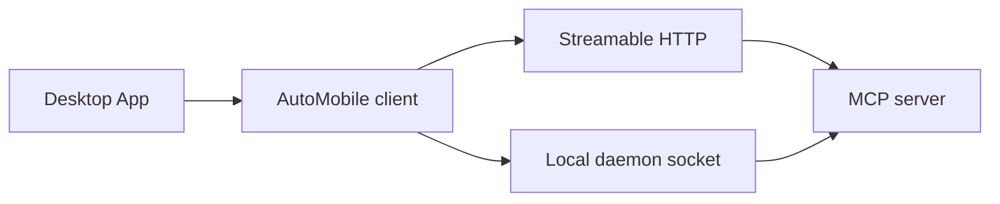

# Desktop App

The AutoMobile Desktop App is a visual workspace for a connected device. Use it when you want to inspect live screens, explore navigation, review failures, or watch performance data without working only through prompts and tool calls.

It connects to AutoMobile automatically and keeps device state, screenshots, and diagnostics in one place. The app is optional: every workflow remains available through the MCP server.

## Connection and device control

```mermaid
flowchart LR
  UI[Desktop App] --> Client[AutoMobile client]
  Client --> HTTP[Streamable HTTP]
  Client --> Socket[Local daemon socket]
  HTTP --> MCP[MCP server]
  Socket --> MCP
```

The Desktop App automatically uses an available local daemon socket or
Streamable HTTP connection. It cannot connect externally to an MCP process over
stdio.

The app watches first. Selecting or viewing a device holds nothing: the app
registers a read-only observer session and may watch any device, including one
another session holds; control stays with the holder. The first tap, swipe, key
or text input on a free device allocates it for the app, and each later input
restarts the 2-minute idle window. When input stops, the daemon releases the
device and the app drops back to watching; the next input allocates it again. If
another session holds the device, the app's input is refused with
`device_owned_by_other_session` and the app shows that refusal. Closing the last
pane or hiding the window releases a device the app holds. See
[device ownership](../../../using/device-ownership.md) and
[environment variables](../../../using/environment-variables.md#session-heartbeat-timeout).
