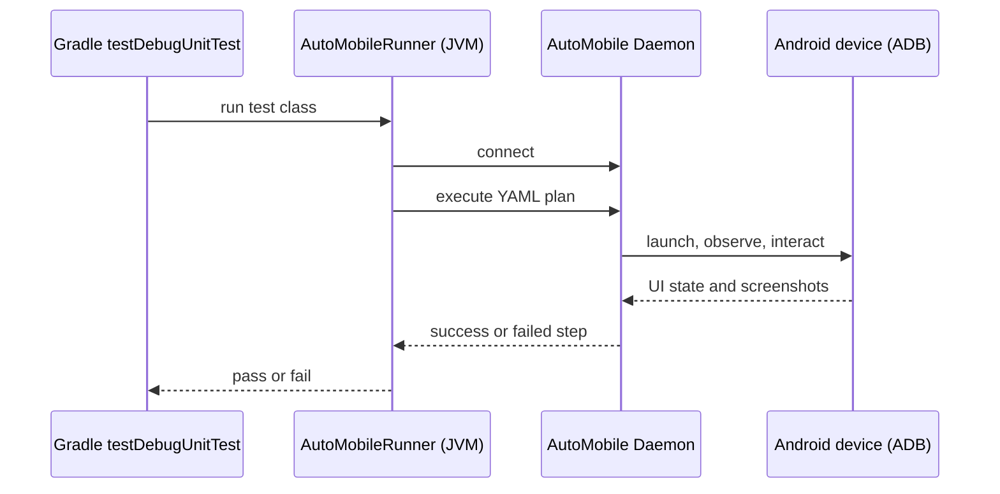

# Android JUnit runner

The Android JUnit runner lets a normal JVM test execute an AutoMobile YAML plan against a connected device. The Kotlin test owns pass/fail assertions; the plan keeps device actions easy to review.



<details open markdown>
<summary>Kotlin JUnit test</summary>

```kotlin
import dev.jasonpearson.automobile.junit.AutoMobilePlan
import dev.jasonpearson.automobile.junit.AutoMobileRunner
import org.junit.Test
import org.junit.runner.RunWith
import kotlin.test.assertTrue

@RunWith(AutoMobileRunner::class)
class LaunchTest {
  @Test
  fun appLaunches() {
    val result = AutoMobilePlan("test-plans/launch-app.yaml").execute()
    assertTrue(result.success, result.output)
  }
}
```

</details>

<details markdown>
<summary>AutoMobile YAML plan</summary>

```yaml
name: launch-app
platform: android
steps:
  - tool: launchApp
    appId: com.example.app
    clearAppData: true
  - tool: observe
    waitFor:
      text: Welcome
      timeout: 10000
```

</details>
