# AutoMobile iOS SDK

<kbd>✅ Implemented</kbd> <kbd>🧪 Tested</kbd>

> **Current state:** `ios/auto-mobile-sdk/` is a Swift Package providing in-app telemetry for iOS applications. Includes navigation tracking (SwiftUI adapter), crash and signal handler capture, main-thread hang detection, handled exception recording, SwiftUI view body evaluation tracking, network request/response monitoring via URLProtocol, structured logging via `os.Logger`, tap interaction tracking, UserDefaults inspection, SQLite database inspection, biometric test injection, local notification posting, and OS-level event observation. Events flow through a disk-first persistence pipeline with retry delivery to CtrlProxy. 151 unit tests across 20 test files.

See the [Status Glossary](../../status-glossary.md) for chip definitions.

## Architecture

```mermaid
flowchart TB
    subgraph "Host App"
        AppInit["App Init"]
    end

    subgraph "AutoMobileSDK" 
        SDK["AutoMobileSDK.shared"]
        Config["AutoMobileConfiguration"]
        Context["SdkContext"]
        Session["SessionTracker"]
    end

    subgraph "Event Pipeline"
        Buffer["SdkEventBuffer"]
        Drop["DropCounter"]
        Broadcaster["SdkEventBroadcaster"]
        Persistence["FileEventPersistence"]
    end

    subgraph "Subsystems"
        Nav["Navigation"]
        Crashes["AutoMobileCrashes"]
        Hangs["AutoMobileHangs"]
        Failures["AutoMobileFailures"]
        Net["AutoMobileNetwork"]
        Log["AutoMobileLog"]
        Interact["InteractionTracker"]
        ViewBody["ViewBodyTracker"]
        Storage["UserDefaults / Database"]
        OsEvents["OsEvents / NotificationObserver"]
    end

    subgraph "Test Hooks"
        Bio["AutoMobileBiometrics"]
        Notif["AutoMobileNotifications"]
    end

    subgraph "Delivery"
        NC["NotificationCenter"]
        HTTP["CtrlProxy HTTP"]
    end

    AppInit -->|"initialize()"| SDK
    SDK --> Config
    SDK --> Context
    SDK --> Session
    SDK --> Buffer

    Nav --> Buffer
    Crashes --> Buffer
    Hangs --> Buffer
    Failures --> Buffer
    Net --> Buffer
    Log --> Buffer
    Interact --> Buffer
    ViewBody --> Buffer
    Storage --> Buffer
    OsEvents --> Buffer
    Notif -.->|"action events"| Buffer

    Buffer -->|"capacity or timer"| Broadcaster
    Drop -.->|"overflow/error counts"| Buffer
    Broadcaster --> Persistence
    Broadcaster --> NC
    Broadcaster -->|"POST /sdk-events"| HTTP
    Persistence -.->|"replay on launch"| Broadcaster

    style SDK fill:#CC2200,color:#fff
    style Buffer fill:#525FE1,color:#fff
    style Broadcaster fill:#525FE1,color:#fff
    style Persistence fill:#525FE1,color:#fff
    style HTTP fill:#007A3D,color:#fff
    style NC fill:#007A3D,color:#fff
```



## Components

| Component | Description | Status |
|-----------|-------------|--------|
| `AutoMobileSDK` | Singleton entry point; initializes all subsystems and manages navigation listeners. | <kbd>✅ Implemented</kbd> <kbd>🧪 Tested</kbd> |
| `AutoMobileConfiguration` | `Sendable` struct with `bufferSize`, `flushIntervalMs`, `maxBreadcrumbs`, `sessionTimeoutMs`, `eventProcessors`, `maxPendingEvents`. Static `.default` property. | <kbd>✅ Implemented</kbd> <kbd>🧪 Tested</kbd> |
| `SdkContext` | Thread-safe mutable context (`@unchecked Sendable`) holding `sessionId`, `userId`, `appVersion`, and tags. Produces immutable `SdkContextSnapshot`. | <kbd>✅ Implemented</kbd> <kbd>🧪 Tested</kbd> |
| `SessionTracker` | Lifecycle-driven session management with configurable timeout. Uses `TimerScheduling` protocol for testability. | <kbd>✅ Implemented</kbd> <kbd>🧪 Tested</kbd> |
| `SdkEventBuffer` | Thread-safe ring buffer with capacity-triggered and timer-triggered flush. Integrates `DropCounting`. | <kbd>✅ Implemented</kbd> <kbd>🧪 Tested</kbd> |
| `SdkEventBroadcaster` | Disk-first broadcaster: persists events, posts to `NotificationCenter`, delivers via HTTP to CtrlProxy (debug builds). | <kbd>✅ Implemented</kbd> <kbd>🧪 Tested</kbd> |
| `DropCounter` | Tracks events lost due to `disabled`, `shutdown`, or `flushError` reasons. | <kbd>✅ Implemented</kbd> <kbd>🧪 Tested</kbd> |
| `FileEventPersistence` | JSON file-backed event persistence with FIFO replay, batch removal, and age-based cleanup. | <kbd>✅ Implemented</kbd> <kbd>🧪 Tested</kbd> |
| `BreadcrumbTrail` | Thread-safe ring buffer with configurable max size and disk persistence for crash recovery. | <kbd>✅ Implemented</kbd> <kbd>🧪 Tested</kbd> |
| `AutoMobileCrashes` | Installs `NSSetUncaughtExceptionHandler` and optional signal handlers (`SIGABRT`, `SIGSEGV`, `SIGBUS`, `SIGFPE`, `SIGILL`). Chains to previous handlers. Signal crash persistence via file marker. | <kbd>✅ Implemented</kbd> <kbd>🧪 Tested</kbd> |
| `AutoMobileHangs` | Main-thread hang detection via watchdog thread + `DispatchSemaphore`. Configurable threshold (default 2000ms) and poll interval (default 500ms). | <kbd>✅ Implemented</kbd> <kbd>🧪 Tested</kbd> |
| `AutoMobileFailures` | Records handled (non-fatal) exceptions with stack traces, device info, and screen context. Keeps last 100 events in memory. | <kbd>✅ Implemented</kbd> <kbd>🧪 Tested</kbd> |
| `NavigationEvent` / `NavigationListener` | Navigation event model with `destination`, `source`, `arguments`, `metadata`. Protocol + closure-based listener. | <kbd>✅ Implemented</kbd> <kbd>🧪 Tested</kbd> |
| `SwiftUINavigationAdapter` | `NavigationFrameworkAdapter` for SwiftUI `NavigationStack`. Includes `.trackNavigation()` `ViewModifier`. | <kbd>✅ Implemented</kbd> <kbd>🧪 Tested</kbd> |
| `AutoMobileNetwork` | URLSession monitoring via `AutoMobileURLProtocol`. Supports header/body capture (debug only for bodies), manual recording, and WebSocket frame tracking. | <kbd>✅ Implemented</kbd> <kbd>🧪 Tested</kbd> |
| `RetryPolicy` | Exponential backoff with jitter for failed HTTP delivery. Retries on network failure, 408, 429, 5xx. | <kbd>✅ Implemented</kbd> <kbd>🧪 Tested</kbd> |
| `AutoMobileLog` | Thin wrappers around `os.Logger` for structured logging. Methods: `v`, `d`, `i`, `w`, `e`, `fault`. Logs are captured by OSLogStore in CtrlProxy. | <kbd>✅ Implemented</kbd> <kbd>🧪 Tested</kbd> |
| `AutoMobileInteractionTracker` | Tap tracking with 100ms debounce. Records coordinates, accessibility label/identifier, view type, and text. UIKit `UITapGestureRecognizer` convenience method. | <kbd>✅ Implemented</kbd> <kbd>🧪 Tested</kbd> |
| `ViewBodyTracker` | Tracks SwiftUI view `body` evaluations with rolling average and duration measurement. Includes `.trackViewBody()` modifier and `MeasureViewBody` wrapper. Periodic snapshot broadcast (1s). | <kbd>✅ Implemented</kbd> <kbd>🧪 Tested</kbd> |
| `UserDefaultsInspector` | Read/write UserDefaults with suite support, change listeners via `UserDefaults.didChangeNotification`, and `SdkStorageChangedEvent` emission. | <kbd>✅ Implemented</kbd> <kbd>🧪 Tested</kbd> |
| `DatabaseInspector` / `SQLiteDatabaseDriver` | SQLite database discovery, table listing, paginated data retrieval, schema inspection, and raw SQL execution via the SQLite3 C API. | <kbd>✅ Implemented</kbd> <kbd>🧪 Tested</kbd> |
| `AutoMobileBiometrics` | Test hook for injecting deterministic biometric authentication results with TTL-based expiry. | <kbd>✅ Implemented</kbd> <kbd>🧪 Tested</kbd> |
| `AutoMobileNotifications` | Posts local notifications via `UNUserNotificationCenter` with action buttons, image attachments, and delegate chaining for action tracking. | <kbd>✅ Implemented</kbd> |
| `AutoMobileOsEvents` | Tracks lifecycle (foreground/background/inactive/terminated), battery level/charging, screen brightness, and network connectivity via `NWPathMonitor`. | <kbd>✅ Implemented</kbd> <kbd>🧪 Tested</kbd> |
| `AutoMobileNotificationObserver` | Monitors system notifications: locale change, timezone change, power state, memory warning, significant time change, screenshot taken. | <kbd>✅ Implemented</kbd> <kbd>🧪 Tested</kbd> |

## Configuration

`AutoMobileConfiguration` is a `Sendable` struct with a static `.default` property:

```swift
AutoMobileConfiguration(
    bufferSize: 50,          // Max events before flush
    flushIntervalMs: 500,    // Timer-based flush interval
    maxBreadcrumbs: 100,     // Ring buffer capacity
    sessionTimeoutMs: 30_000, // Background timeout before new session
    eventProcessors: [],     // Pre-buffer event processors (return nil to drop)
    maxPendingEvents: 500    // Max pending events before oldest are dropped
)
```

All values are clamped to a minimum of 1. `eventProcessors` conforms to the `EventProcessing` protocol, allowing events to be transformed or dropped before buffering.

## Initialization

```swift
// Default configuration
AutoMobileSDK.shared.initialize(bundleId: "com.example.app")

// Custom configuration
AutoMobileSDK.shared.initialize(
    bundleId: "com.example.app",
    configuration: AutoMobileConfiguration(bufferSize: 100, flushIntervalMs: 1000)
)
```

`initialize()` is idempotent -- subsequent calls are no-ops. It sets up:

1. `SdkContext` with `appVersion` from `CFBundleShortVersionString`
2. `FileEventPersistence` in `Library/Caches/automobile_events/`
3. `SdkEventBuffer` with configured capacity and flush interval
4. All subsystems (Log, Network, Failures, Crashes, Hangs, OsEvents, NotificationObserver, InteractionTracker, ViewBodyTracker, UserDefaultsInspector, DatabaseInspector)
5. `SwiftUINavigationAdapter` auto-started
6. `SessionTracker` with `UIApplication` notification observers for foreground/background transitions
7. Replay of pending event batches from previous sessions; cleanup of batches older than 7 days

## Event Pipeline

Events flow through a three-stage pipeline:

1. **Buffer** -- `SdkEventBuffer` collects events from all subsystems. Most events flush when capacity is reached or on a periodic timer. `notifyNavigationEvent(_:)` also flushes immediately: navigation routes and their arguments are the SDK-backed screen identity used by `observe` and action diffs, so they must be available before the next observation. When the buffer is disabled or a flush fails, the `DropCounter` records the loss reason.

2. **Persist** -- `SdkEventBroadcaster` writes each batch to disk via `FileEventPersistence` before attempting delivery. On next app launch, `replayPending()` retries any unsent batches.

3. **Deliver** -- Batches are posted to `NotificationCenter` (in-process observers) and, in debug builds, sent via HTTP POST to `http://localhost:8765/sdk-events` (CtrlProxy). Failed HTTP deliveries are retried with exponential backoff per `RetryPolicy`.

### Event types

All events conform to `SdkEvent` (Codable + Sendable) with a `SdkEventType` discriminator and millisecond-epoch timestamp. Supported types: `navigation`, `handled_exception`, `crash`, `hang`, `network_request`, `websocket_frame`, `log`, `lifecycle`, `notification_action`, `view_body_snapshot`, `broadcast`, `interaction`, `storage_changed`.

## Context

`SdkContext` is a thread-safe mutable store (`@unchecked Sendable` with `NSLock`) holding ambient state that can be attached to events:

- `sessionId` -- set automatically by `SessionTracker`
- `userId` -- set via `AutoMobileSDK.shared.setUserId(_:)`
- `appVersion` -- set automatically from `Bundle.main`
- Tags -- arbitrary string key-value pairs via `setTag(_:value:)` / `removeTag(_:)`

`snapshot()` produces an immutable `SdkContextSnapshot` (Codable, Sendable, Equatable).

## Session Tracking

`SessionTracker` manages session lifecycle based on app foreground/background transitions:

- **First foreground** -- generates a new session ID via `UUID().uuidString`
- **Background** -- starts a timeout timer (default 30s, configurable via `sessionTimeoutMs`)
- **Foreground while backgrounded** -- cancels timeout, resumes existing session
- **Timeout fires while backgrounded** -- ends session, clears session ID

The `TimerScheduling` protocol (with `GCDTimer` default) allows injecting `FakeTimer` in tests.

## Breadcrumbs

`BreadcrumbTrail` is a thread-safe ring buffer of `Breadcrumb` entries with categories: `navigation`, `tap`, `lifecycle`, `network`, `log`, `custom`.

Supports disk persistence for crash recovery:
- `writeToDisk()` serializes breadcrumbs to `Library/Caches/automobile_breadcrumbs.json`
- `loadFromDisk()` restores breadcrumbs from a previous session
- `clearDisk()` removes the persisted file

## Crash and Hang Detection

### AutoMobileCrashes

Captures unhandled crashes via two mechanisms:

1. **NSSetUncaughtExceptionHandler** -- installed during `initialize()`. Captures exception name, reason, and call stack symbols. Chains to any previously installed handler.

2. **Signal handlers** (opt-in via `enableSignalHandlers()`) -- intercepts `SIGABRT`, `SIGSEGV`, `SIGBUS`, `SIGFPE`, `SIGILL`. The signal handler writes the signal number to a file using only async-signal-safe POSIX calls (`open`, `write`, `close`). On next launch, `checkPreviousSignalCrash()` reads the file and emits a `SdkCrashEvent`. `SIGTRAP` is excluded because it interferes with debuggers.

### AutoMobileHangs

Main-thread hang detection (iOS equivalent of Android ANR detection):

- A background watchdog thread dispatches a semaphore signal to the main queue
- If the main queue does not respond within `hangThresholdMs` (default 2000ms), a hang event is recorded
- Polls every `pollIntervalMs` (default 500ms)
- Captures the watchdog thread's stack as a diagnostic marker (iOS does not expose a public API for capturing another thread's stack; MetricKit `MXHangDiagnostic` is recommended for production)

### AutoMobileFailures

Records non-fatal handled exceptions via `recordHandledException(_:message:currentScreen:)`. Captures `NSError` domain, localized description, call stack symbols, device info, and optional screen context. Keeps the last 100 events in memory.

## Navigation

### Event model

`NavigationEvent` contains `destination`, `source` (`NavigationSource` enum: `swiftUINavigation`, `uiKitNavigation`, `deepLink`, `custom`), millisecond timestamp, string arguments, and metadata.

### Listener pattern

`NavigationListener` is a protocol with `onNavigationEvent(_:)`. `BlockNavigationListener` provides closure-based convenience. Listeners are registered on `AutoMobileSDK.shared`.

### SwiftUI adapter

`SwiftUINavigationAdapter` implements `NavigationFrameworkAdapter` and provides:

- `trackNavigation(destination:arguments:metadata:)` for manual tracking
- `.trackNavigation(destination:)` SwiftUI `ViewModifier` that fires on `onAppear`

## Network Monitoring

`AutoMobileNetwork` provides two approaches:

1. **URLProtocol** -- `AutoMobileURLProtocol` intercepts all HTTP/HTTPS requests when registered via `URLSessionConfiguration.protocolClasses`. Captures URL, method, status code, headers (opt-in), request/response bodies (debug-only, configurable max 32KB), duration, and content type. Uses ephemeral URLSession to avoid infinite recursion.

2. **Manual recording** -- `recordRequest(url:method:...)` for cases where URLProtocol cannot be used. `recordWebSocketFrame(url:direction:frameType:payloadSize:)` for WebSocket tracking.

3. **Transport-neutral lifecycle recording** -- `AutoMobileNetwork.shared.captureRecorder()` provides
   thread-safe `beginRequest`, header/body chunk, completion, and failure methods for custom
   `URLSession` delegates, `URLSessionWebSocketTask`, `NWConnection`, and third-party clients.
   `URLSessionNetworkCaptureAdapter`, `WebSocketNetworkCaptureAdapter`, and
   `NWConnectionNetworkCaptureAdapter` are explicit integrations; they do not swizzle global
   networking behavior or install a proxy. Each completed request has a stable request ID and
   optional connection ID. Completion is idempotent, payload text is bounded, and common
   credential headers are redacted before emission. Set `samplingRate` or `isEnabled` on a
   recorder when the host needs bounded collection. Apps must still provide any transport
   metadata that the system does not expose to the adapter, and unsupported third-party
   transports require the manual adapter.

Body capture is always disabled in release builds to prevent leaking credentials or PII.

## Logging

`AutoMobileLog` provides filter-based log capture. Filters are registered by name via `addFilter(name:tagPattern:messagePattern:minLevel:)` with optional `NSRegularExpression` patterns for tag and message, plus a minimum `LogLevel` (`verbose`, `debug`, `info`, `warning`, `error`, `fault`). Filters can be removed individually with `removeFilter(name:)` or all at once with `clearFilters()`.

Log methods mirror standard log levels: `v()`, `d()`, `i()`, `w()`, `e()`, `fault()`. Each method accepts an optional `tag` parameter that is formatted as a `[tag] message` prefix. Logs are written to Apple's unified logging system with `privacy: .public` (non-redacted, visible in Console.app and OSLogStore). Note that `.public` disables redaction — sensitive fields such as PII or credentials must not be passed through these log methods.

Only entries matching at least one active filter are buffered as `SdkLogEvent`. Filters gate OSLogReader output only — they do not buffer events into `SdkEventBuffer` (CtrlProxy's `/sdk-events` endpoint already reads from `OSLogStore`).

**Severity level mapping:** Android `wtf` (What a Terrible Failure) corresponds to iOS `fault`. Both represent the highest severity log level on their respective platforms.

## Interaction Tracking

`AutoMobileInteractionTracker` records tap events with 100ms debounce. Each event captures:
- Screen coordinates (`x`, `y`)
- `accessibilityLabel`, `accessibilityIdentifier`
- `viewType` (class name)
- `text` (UILabel/UIButton text)

UIKit convenience: `recordTap(from:in:)` accepts a `UITapGestureRecognizer` and automatically inspects the view hierarchy via `hitTest`.

## View Body Tracking

`ViewBodyTracker` tracks SwiftUI view `body` evaluations (iOS equivalent of Android's `RecompositionTracker` for Compose):

- `recordBodyEvaluation(id:viewName:)` increments evaluation count and maintains a 1-second rolling window for average calculations
- `recordDuration(id:durationMs:)` records composition duration
- `.trackViewBody(id:)` SwiftUI `ViewModifier` for automatic tracking
- `MeasureViewBody` wrapper view that measures `body` evaluation duration via `CFAbsoluteTimeGetCurrent()`
- Periodic snapshot broadcast every 1 second when enabled

## Storage Inspection

### UserDefaultsInspector

Debug-time `UserDefaults` inspection (iOS equivalent of Android's `SharedPreferencesInspector`):

- `UserDefaultsDriver` protocol with `getSuites()`, `getValues()`, `getValue()`, `setValue()`, `removeValue()`, `clear()`
- Write/clear operations are `#if DEBUG` guarded
- Change listeners via `UserDefaults.didChangeNotification`
- Emits `SdkStorageChangedEvent` with sequence numbers on changes
- **Production trigger (decision, #3193):** `setEnabled(true)` auto-starts standard-suite
  change listening (chosen over an Android-style desktop command handler and over a
  separate host opt-in step), so `initialize` + `setEnabled(true)` is the complete
  integration. If `setEnabled(true)` runs before `initialize`, the auto-start is
  deferred to `initialize` so the diff baseline is seeded from a real driver read.
  Hosts can still call `startListening(suiteName:)` for a specific app-group suite;
  a later `setEnabled(true)` never replaces an already-registered observer.
- **System-key noise filter:** `dictionaryRepresentation()` merges `NSGlobalDomain`
  into every suite's search list, so diff snapshots drop keys with the well-known
  system prefixes `com.apple.`, `NS`, and `Apple` — OS-churned prefs never emit
  `storage_changed` events. Inspection reads via `getDriver()` are unfiltered.

### DatabaseInspector / SQLiteDatabaseDriver

SQLite database inspection using the `sqlite3` C API directly:

- Discovers `.sqlite`, `.db`, `.sqlite3` files in Documents, Library, and Application Support directories
- Table listing, paginated data retrieval, schema inspection via `PRAGMA table_info`
- Raw SQL execution with read/write detection (SELECT/EXPLAIN/PRAGMA = read-only, opens with `SQLITE_OPEN_READONLY`)
- Connection caching, 5-second busy timeout, identifier sanitization
- MCP `sqlQuery` and database resources are available on iOS through the DEBUG-only in-app SDK HTTP server on port 8766, relayed by CtrlProxy on port 8765. Apps must call `DatabaseInspector.shared.setEnabled(true)`.

## Other Subsystems

### AutoMobileBiometrics

Test hook for deterministic biometric testing. `overrideResult(_:ttlMs:)` sets a one-shot result (`success`, `failure`, `cancel`, or `error`) with TTL-based expiry (default 5s). `consumeOverride()` returns and clears the override atomically. Posts `Notification.Name` when override is set.

### AutoMobileNotifications

Posts local notifications via `UNUserNotificationCenter`:
- Supports title, body, image attachments (local files or remote URLs downloaded to temp), and action buttons
- Registers `UNNotificationCategory` for actions, merging with existing app categories
- `installActionHandler(on:)` installs a `UNUserNotificationCenterDelegate` that chains to any previous delegate and emits `SdkNotificationActionEvent` on action taps

### AutoMobileOsEvents

Tracks OS-level lifecycle events:
- App lifecycle: foreground, background, inactive, terminated (via `UIApplication` notifications)
- Battery: level and charging state changes (via `UIDevice.batteryLevelDidChangeNotification`)
- Screen: brightness changes (via `UIScreen.brightnessDidChangeNotification`)
- Connectivity: network status and transport type (via `NWPathMonitor`)

### AutoMobileNotificationObserver

Monitors system `NotificationCenter` broadcasts:
- `NSLocale.currentLocaleDidChangeNotification`
- `.NSSystemTimeZoneDidChange`
- `.NSProcessInfoPowerStateDidChange`
- `UIApplication.didReceiveMemoryWarningNotification`
- `UIApplication.significantTimeChangeNotification`
- `UIApplication.userDidTakeScreenshotNotification`

Records `SdkBroadcastEvent` with notification action name and user info key types (not values, to avoid leaking sensitive data).

## Thread Safety

All public classes use `@unchecked Sendable` with `NSLock` for thread safety. The pattern is consistent across the SDK:

```swift
public final class Component: @unchecked Sendable {
    private let lock = NSLock()
    private var _state: State

    public var state: State {
        lock.lock()
        defer { lock.unlock() }
        return _state
    }
}
```

All protocols extend `AnyObject` and `Sendable` to enable faking in tests while maintaining concurrency safety.

## Testing

The SDK uses protocol + fake pattern throughout for testability:

- `EventBuffering` protocol with fake for `SdkEventBuffer`
- `TimerScheduling` protocol with `GCDTimer` (production) and injectable fake timers
- `SessionTracking` protocol with injectable UUID provider and timer factory
- `DropCounting` protocol with `DefaultDropCounter`
- `EventPersisting` protocol with `FileEventPersistence`
- `UserDefaultsDriver` and `DatabaseDriver` protocols with fakeable implementations

151 tests across 20 test files covering all subsystems. Test distribution: RetryPolicy (17), SdkContext (16), SetEnabledPropagation (12), DropCounter (10), BreadcrumbTrail (9), EventBuffer (9), EventPersistence (9), Configuration (8), Navigation (8), SDK integration (8), Biometrics (7), Storage (7), SessionTracker (6), InteractionTracker (5), ViewBodyTracker (5), OsEvents (4), Concurrency (3), Failures (3), Network (3), Log (2).

## Cross-Platform Parity

| Feature | Android | iOS | Notes |
|---------|---------|-----|-------|
| Singleton SDK | `AutoMobileSDK` | `AutoMobileSDK.shared` | Same pattern |
| Configuration | `AutoMobileConfiguration` | `AutoMobileConfiguration` | Same fields |
| Event buffer | `SdkEventBuffer` | `SdkEventBuffer` | Same capacity/timer design |
| Event persistence | `FileEventPersistence` | `FileEventPersistence` | Disk-first, replay on launch |
| Drop counter | `DropCounter` | `DefaultDropCounter` | Same reasons |
| Context | `SdkContext` | `SdkContext` | Same snapshot pattern |
| Session tracking | `SessionTracker` | `SessionTracker` | Lifecycle-based with timeout |
| Breadcrumbs | `BreadcrumbTrail` | `BreadcrumbTrail` | Ring buffer + disk |
| Navigation | Navigation3Adapter, CircuitAdapter | SwiftUINavigationAdapter | Framework-specific adapters |
| Crash detection | `AutoMobileCrashes` (UncaughtExceptionHandler) | `AutoMobileCrashes` (NSSetUncaughtExceptionHandler + signals) | iOS adds signal handler support |
| ANR / Hang detection | `AutoMobileAnr` | `AutoMobileHangs` | Watchdog thread approach |
| Handled exceptions | `AutoMobileFailures` | `AutoMobileFailures` | Same API shape |
| Network monitoring | OkHttp Interceptor | URLProtocol | Platform-native interception |
| WebSocket tracking | `AutoMobileWebSocketListener` | `recordWebSocketFrame()` | Manual on iOS |
| Log filtering | `AutoMobileLog` | `AutoMobileLog` | Android: regex filters with first-match semantics; iOS: `os.Logger` wrappers (filtering via OSLogStore) |
| Interaction tracking | `AutoMobileClickTracker` | `AutoMobileInteractionTracker` | Tap with debounce |
| View rendering tracking | `RecompositionTracker` (Compose) | `ViewBodyTracker` (SwiftUI) | Platform-specific UI framework |
| Key-value storage | `SharedPreferencesInspector` | `UserDefaultsInspector` | Platform-native storage |
| Database inspection | `DatabaseInspector` / `SQLiteDatabaseDriver` | `DatabaseInspector` / `SQLiteDatabaseDriver` | Same schema |
| Biometric injection | `AutoMobileBiometrics` | `AutoMobileBiometrics` | Same override + TTL pattern |
| Notifications | `AutoMobileNotifications` | `AutoMobileNotifications` | Platform notification APIs |
| OS events | `AutoMobileOsEvents` | `AutoMobileOsEvents` | Lifecycle, battery, connectivity |
| Broadcast / System events | `AutoMobileBroadcastInterceptor` | `AutoMobileNotificationObserver` | BroadcastReceiver vs NotificationCenter |
| Network mock rules and error simulation | `NetworkMockRuleStore` | `NetworkMockRuleStore` | DEBUG-only; iOS requires sessions to register `AutoMobileNetwork.shared.protocolClass()`; error simulation also requires the supporting iOS CtrlProxy runner release or a local runner override |

## See also

- [iOS platform overview](index.md)
- [Android SDK](../android/auto-mobile-sdk.md)
- [Status Glossary](../../status-glossary.md)
